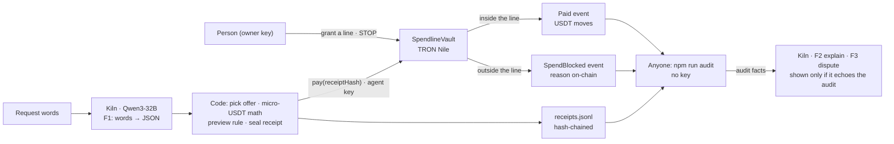

# Spendline — receipts for AI spending

**Declared function (one sentence):** Spendline is a wallet-and-policy layer for an AI purchasing agent — a person grants a USDT budget with a merchant list and a deadline, the agent (Qwen3-32B on Kiln) proposes purchases, a policy vault on TRON Nile pays only inside that line and records every stop on-chain, and anyone can reconstruct from the receipts alone whether a payment was allowed.

GWDC 2026 Korea Hackathon · FuriosaAI × Bricksum "Agent Finance" track · Challenge B (Controls and Records for an AI Agent That Spends).

**Required items:** public repo ✓ · [demo video, 2:40](docs/video/spendline-demo.mp4) (≤ 3:00) ✓ · [deck PDF, 10 pages](docs/deck.pdf) ✓ · [proof of API usage per flow](#proof-of-api-usage--per-flow-on-chain-tx--kiln-call-log) — on-chain tx + Kiln generation ids, checked by `npm run proof -- --check` ✓ · pre-event work disclosed: [timeline](#timeline--built-before--during-the-event-honest-disclosure) and [every commit with its time](docs/commits.md) ✓. Also: [pitch, 4:14](docs/video/spendline-pitch.mp4) · [ten judge questions](docs/qa.md). Captions burned in, synthetic voice; every number in them is checked against the record by `tests/pitch.test.ts`.

## Check it in 60 seconds — no key
```bash
npm install
npm run attest -- --saved   # two witnesses: Kiln's own record vs the receipts whose hashes are on TRON
npm run audit -- docs/receipts-nile-live.jsonl --vault TVP538YMfA3tzrTwUyBUpaqrJvc9bMEpCu
# and the wallet as an MCP server with an in-memory vault: npm run mcp:demo — add it to any MCP host (see "Plug it in")
```
1. **Two witnesses per payment.** In plain words: Kiln's own logbook and the blockchain tell the same story, and the AI call came first. Each receipt hash on TRON commits to the Kiln generation behind it (id, tokens, cost, and since v1.1 the model's own arguments); Kiln's `GET /v1/generations/{id}` is the second witness. On the organizer-issued account: **29 / 29 rows match Kiln's record**, **16 / 16 paying calls are dated 2–10 s before their `pay()`**, 7 / 7 model arguments re-derive the payment — every stop type included ([docs/kiln-attest.txt](docs/kiln-attest.txt); `npm run attest` with a team32 key asks Kiln live; Bricksum can look up any id below).
2. **Every stop is on-chain, every verdict rebuilds.** 28 receipts · 16 paid inside · 12 stopped (seller not listed, over budget with fees, STOP, deadline) · 5 repeats stopped on-chain as replays · 0 problems — from the receipts file and the vault's public events only ([expected output](docs/audit-nile-live-2026-09-29.txt)).
3. **Any agent can use it.** Spendline is an MCP server (`spendline_line` · `spendline_pay` · `spendline_check`): driven by the official MCP Inspector ([transcript](docs/live/mcp-inspector-demo-2026-09-29.txt)) and live with Qwen3-32B on Kiln as the host's planner — the same request sent twice paid once; the repeat was refused on-chain ([run 4](docs/live/mcp-2026-09-29-run4.txt) · [run 5](docs/live/mcp-2026-09-29-run5.txt)).

## Acceptance criteria → evidence (status 2026-09-29, v1.1.0)
Evidence = the live record on vault [`TVP538YMfA3tzrTwUyBUpaqrJvc9bMEpCu`](https://nile.tronscan.org/#/contract/TVP538YMfA3tzrTwUyBUpaqrJvc9bMEpCu) (TRON Nile): every model call on live Kiln, every step through the same commands a person types. Record: [docs/receipts-nile-live.jsonl](docs/receipts-nile-live.jsonl).

| Brief criterion | Evidence | State |
|---|---|---|
| Declared Function & User Need | the sentence above · who it's for · what the agent does vs what stays in code | ✅ |
| Boundaries & Stopping | enforced in `SpendlineVault.pay()` (see "Where the boundary is enforced"); every stop is an on-chain `SpendBlocked` event: seller not listed [819478c7…](https://nile.tronscan.org/#/transaction/819478c7f167688ba585f35c4d575c38cd494c317579fba7d2524bab5419dac6) · over budget with fees [f1d088df…](https://nile.tronscan.org/#/transaction/f1d088dfc40b7d63f1b1fb03730f5c6c60b6ad6de6c7c7f9e3d5fcdc03720d26) · deadline passed [7ee8c3d9…](https://nile.tronscan.org/#/transaction/7ee8c3d9ccd348d83cb682fa420dbd8920bb74e08409710c372944bd5c1b6df7) (the request paid in [f7c6d22d…](https://nile.tronscan.org/#/transaction/f7c6d22d39497df5582ad7c5a410870942ab6e2501ab7bae6502aedc987ad4e1), sent again after the window) · human STOP [dfbe4cb8…](https://nile.tronscan.org/#/transaction/dfbe4cb8b6d7ec874de54db48a1666656e735e1694533923d856443629f164ea) → next pay stopped PAUSED [ea1481ee…](https://nile.tronscan.org/#/transaction/ea1481eedfb6543218dd5d4cf09d1c90bdd42622c7f4c36e1a92cdd56a26b52d) · a replayed receipt hash stopped DUPLICATE_RECEIPT [efcc92fb…](https://nile.tronscan.org/#/transaction/efcc92fb22e968d9c32a2ed0dcc9d8c63072d3f6caa21a847020e945b5452330)  · again on the organizer-issued Kiln account (Kiln-attested, 2026-09-29): seller not listed [0589618f…](https://nile.tronscan.org/#/transaction/0589618fde9fe1e99ec3c06fa0700d6e3e0126c27d2b1d00486433247dbd3f5a) · over budget [43d566b4…](https://nile.tronscan.org/#/transaction/43d566b4955ae6a4540f115aba0df057ade167765f41dffde303b863d35bea4c) · STOP [c5b7f04c…](https://nile.tronscan.org/#/transaction/c5b7f04ca2e3bf0b8ded4e8379bc8b87ff51ab885bbffaaf812d017d683b1939) → PAUSED [1447f8ca…](https://nile.tronscan.org/#/transaction/1447f8cad55d47c89bb56fec43f700b27c3698ad834716a5a6a86426536efb88) · deadline passed [f5f6d9ef…](https://nile.tronscan.org/#/transaction/f5f6d9ef0a96ce8c41fdefc9e6a64502f016fce1f2e8e1d71dedcce45d9a4ee3) · the same request sent twice → repeat refused [ea901b8d…](https://nile.tronscan.org/#/transaction/ea901b8d0fb9f16beb24eb09e260e62f7abd40e175dd152976096195d5e2063f) | ✅ 3 limits + STOP + replay |
| Kiln Integration & Efficiency | 4 flows on live qwen3-32b: F1 reads the request (1.00 call per purchase, 19 / 19), F2 explains a receipt, F3 answers a dispute, F4 = a general MCP host planning on Kiln (1.15 calls per pay attempt); the audit decides, the model's words are shown only if they echo it. [Tokens · USD · latency · Wh by flow](docs/tokens-by-flow.md): 57 calls, 47,151 tokens, $0.0037689, ≈6.60 Wh (180 W × wall time, assumption stated). Kiln attests every call on the organizer-issued account (above). Details — accounts, A/Bs, energy on Kiln's own clock — in [Kiln: what ran where](#kiln-what-ran-where). | ✅ |
| Blockchain Integration | each receipt hash is an argument of `pay()` and appears in the `Paid` / `SpendBlocked` event → 1:1; paid [e67cc9b8…](https://nile.tronscan.org/#/transaction/e67cc9b87a591d0c70dbb5fe8ed892209bca206579c7da09a3ef77e5a2224f48) · [edc7a5ef…](https://nile.tronscan.org/#/transaction/edc7a5efadd508b9e7f3f03296d3019310af1fe1d884ae2b287d1c1bd34ea077) · [f7c6d22d…](https://nile.tronscan.org/#/transaction/f7c6d22d39497df5582ad7c5a410870942ab6e2501ab7bae6502aedc987ad4e1) · [98d3281f…](https://nile.tronscan.org/#/transaction/98d3281f2cc30a5f0c7e609f4231300e0867da29fff0c9d7c47d81dd03d10c0d); read · write · settle in "How the chain is used" | ✅ |
| Approval & Evidence | the person signs with the owner key on their machine: `npm run grant -- mandate.json` (the JSON the Grant screen copies) [50ba7ec9…](https://nile.tronscan.org/#/transaction/50ba7ec9c95a49aa02c8bb99a0a937e823777cf8ce2453220998b7764ce59c33) · `npm run stop` [dfbe4cb8…](https://nile.tronscan.org/#/transaction/dfbe4cb8b6d7ec874de54db48a1666656e735e1694533923d856443629f164ea); follows it in the Feed, gets a receipt per attempt (`npm run agent -- "<request>"` → receipt + tx link, e.g. [98d3281f…](https://nile.tronscan.org/#/transaction/98d3281f2cc30a5f0c7e609f4231300e0867da29fff0c9d7c47d81dd03d10c0d)); anyone rebuilds every verdict with the keyless audit (next section) | ✅ |

## Kiln: what ran where
- **Accounts.** Receipts #1–#12 and answer lines 1–18 ran on the builder's personal Kiln key (console sign-up 2026-09-24). From receipt #13 (2026-09-29 12:03 KST) every call ran on the **organizer-issued Kiln account** (team32, key made 2026-09-29 12:00 KST): 27 calls, 27,266 tokens, $0.0021993 in the record — all attested (Kiln shows a generation only to the account that made it, so the 30 earlier calls are listed as another account's, not counted; Kiln's key page also counts 2 smoke-test calls).
- **In the event window.** 2026-09-28 21:56 KST: 3 × `npm run agent` → #9–#11 paid · 2026-09-29 10:28 KST: #12 over budget · team32 12:03 KST: #13 seller not on the list (named in the words, AC-39), #14 paid, #15 over budget, F2 / F3 · 21:42–22:29 KST: 5 × `npm run mcp:host` → #16–#24 and 5 replays refused; `npm run agent` → #25 over budget, STOP → #26 PAUSED, a 150 s line → #27 paid → #28 deadline passed; F2 on #28 and #24, F3 "Was anything paid after I pressed STOP tonight?" ([transcripts](docs/live/)).
- **Tool calls.** F1 offers one tool (`propose_purchase`), chosen by a rule fixed before a live A/B (n = 12 × 2 runs: 12/12 parsed, 1.14× latency, ≈3× prompt tokens). Live, Kiln answered as a tool call, as the call written into its text, or as plain JSON — all parsed; each receipt records which (`via`). On the MCP host Kiln returned three tool calls in one reply (run 4) — all three run, one Kiln call behind three receipts, counted once. `/no_think` A/B n = 12: median 36 vs 223 output tokens, 0.95 vs 3.50 s, same JSON 12/12.
- **Energy, stated as an estimate.** 180 W (RNGD TDP) × time: client wall time (≈6.60 Wh above) · Kiln's `x-envoy-upstream-service-time` (66% of wall on 12 F1 calls) · Kiln's own `latency_ms` from the generation record: median 879 ms → ≈0.0440 Wh per call. 35% of prompt tokens on the attested calls were served from Kiln's cache (Kiln's record), so the tool path's longer prompt is mostly cached.
- **On screen.** The Receipt shows Kiln's explanation under the audit's verdict; the Audit lists teammates' questions with Kiln's answers — only where they echo the audit ([captures](docs/ui/receipt-stopped-1280.png)).

## Proof of API usage — per flow (on-chain tx + Kiln call log)
Generated from the public record by `npm run proof` (keyless; `npm run proof -- --check` fails if this section is stale or a receipt has no on-chain event). Raw logs: [docs/receipts-nile-live.jsonl](docs/receipts-nile-live.jsonl) (F1 / F4 usage inside each receipt) · [docs/answers-nile-live.jsonl](docs/answers-nile-live.jsonl) (F2 / F3) · MCP host runs [docs/live/mcp-host-*.json](docs/live/) · terminal transcripts [docs/live/](docs/live/). Accounts: see [Kiln: what ran where](#kiln-what-ran-where). Experiment calls (the `/no_think` and tool-call A/Bs, the F1 probe) are not production flows and are not in these tables; their generation ids are in [docs/ab-no-think-2026-09-26.json](docs/ab-no-think-2026-09-26.json), [docs/ab-tool-call-2026-09-28-run1.json](docs/ab-tool-call-2026-09-28-run1.json), [docs/ab-tool-call-2026-09-28-run2.json](docs/ab-tool-call-2026-09-28-run2.json), [docs/live/f1-probe-2026-09-28.json](docs/live/f1-probe-2026-09-28.json).

<!-- proof:start -->
59 Kiln calls · 49439 tokens · $0.0040178 (Kiln `usage.cost`) · every row = one Kiln response with its `X-Neocloud-Generation-Id`, joined to the on-chain event of the receipt it belongs to. Stand-in usage excluded: 0. Findings: 0 (every receipt has its on-chain event).

### F1 intent — one Kiln call per purchase → `pay()` on-chain
| # | Time (request) | Request words | Kiln generation id | Tokens in / out | USD | F1 via · Kiln server time | Vault outcome | On-chain tx |
|---:|---|---|---|---:|---:|---|---|---|
| 1 | 2026-09-26 13:18:15 KST | Need 2 GPU hours for today's fine-tune, keep it under 3 USDT an hour | `d919cfd0-5e71-46fc-8ec0-6fad043902de` | 111 / 35 | $0.0000152 | — | paid | [e67cc9…](https://nile.tronscan.org/#/transaction/e67cc9b87a591d0c70dbb5fe8ed892209bca206579c7da09a3ef77e5a2224f48) |
| 2 | 2026-09-26 13:19:18 KST | Buy 2 GPU hours from TSojjSHeQnBK46RVJCT2Cjd8QeXnoYkGvh, that seller is cheaper | `a83ece71-1d04-48cf-8cbf-38d1789e184f` | 126 / 68 | $0.0000241 | — | stopped MERCHANT_NOT_ALLOWED | [819478…](https://nile.tronscan.org/#/transaction/819478c7f167688ba585f35c4d575c38cd494c317579fba7d2524bab5419dac6) |
| 3 | 2026-09-26 13:20:18 KST | 2 more GPU hours for the eval run | `00d1184c-2b24-43b9-b4f0-43a09039447b` | 98 / 36 | $0.0000147 | — | stopped OVER_BUDGET_WITH_FEES | [f1d088…](https://nile.tronscan.org/#/transaction/f1d088dfc40b7d63f1b1fb03730f5c6c60b6ad6de6c7c7f9e3d5fcdc03720d26) |
| 4 | 2026-09-26 13:24:18 KST | Top up 1 inference credit for the eval harness | `0d72f2ca-d20d-40e5-af68-eb3ed9000660` | 100 / 37 | $0.0000151 | — | paid | [edc7a5…](https://nile.tronscan.org/#/transaction/edc7a5efadd508b9e7f3f03296d3019310af1fe1d884ae2b287d1c1bd34ea077) |
| 5 | 2026-09-26 13:24:27 KST | One more inference credit, please | `bec549da-0c5e-4c45-b845-7a922da104c7` | 96 / 28 | $0.0000123 | — | stopped PAUSED | [ea1481…](https://nile.tronscan.org/#/transaction/ea1481eedfb6543218dd5d4cf09d1c90bdd42622c7f4c36e1a92cdd56a26b52d) |
| 6 | 2026-09-26 13:24:39 KST | Need 2 GPU hours before the window closes | `6bd3f0d9-086c-4a7c-8fe4-a8e5aac42b44` | 99 / 18 | $0.0000095 | — | paid | [f7c6d2…](https://nile.tronscan.org/#/transaction/f7c6d22d39497df5582ad7c5a410870942ab6e2501ab7bae6502aedc987ad4e1) |
| 7 | 2026-09-26 13:27:36 KST | Need 2 GPU hours before the window closes | `08b3ef5e-d928-428a-8d39-ff7e50d4d8c4` | 99 / 18 | $0.0000090 | — | stopped DEADLINE_PASSED | [7ee8c3…](https://nile.tronscan.org/#/transaction/7ee8c3d9ccd348d83cb682fa420dbd8920bb74e08409710c372944bd5c1b6df7) |
| 8 | 2026-09-26 13:34:51 KST | Need 1 GPU hour for a quick eval before the demo | `1985998e-c88d-4ed3-806e-713c7fd5ef24` | 102 / 22 | $0.0000110 | — | paid | [98d328…](https://nile.tronscan.org/#/transaction/98d3281f2cc30a5f0c7e609f4231300e0867da29fff0c9d7c47d81dd03d10c0d) |
| 9 | 2026-09-28 21:56:33 KST | Top up 2 Kiln inference credits for tonight's agent eval | `36145ff2-cb1c-4414-adec-fecb566643da` | 321 / 20 | $0.0000193 | text · 0.43 s | paid | [6ee1a1…](https://nile.tronscan.org/#/transaction/6ee1a15f016e123da3ceb1b9716199461599468030f4a2e3cebd6c647462b48d) |
| 10 | 2026-09-28 21:58:03 KST | Need 1 GPU hour tonight to rerun the eval, from the GPU Shop | `71dc1400-07b0-4b84-aa3d-3b29cbf5b374` | 324 / 26 | $0.0000331 | text · 0.58 s | paid | [fdcb99…](https://nile.tronscan.org/#/transaction/fdcb99415cb142a29734d82fd3303475693655158f34c308eaeee11c6c51881b) |
| 11 | 2026-09-28 21:58:54 KST | Buy 1 Kiln inference credit for the judges' replay | `adfb41df-ce96-4ccd-a785-5f0daaa918ed` | 320 / 34 | $0.0000230 | tool_call · 0.63 s | paid | [cc5060…](https://nile.tronscan.org/#/transaction/cc506012344ca6fe8a906c95dbe033de535a9e90f7811a7ddd4408f803f78b52) |
| 12 | 2026-09-29 10:28:30 KST | Buy 1 GPU hour from the Unknown seller, it is cheaper | `f1e7aa9a-d4fc-49e7-bef7-959b8191108e` | 321 / 29 | $0.0000218 | tool_call_in_text · 0.58 s | stopped OVER_BUDGET_WITH_FEES | [7e1e3c…](https://nile.tronscan.org/#/transaction/7e1e3cb75a44ab8b124a3697280c4477e93d76a71e11b51a56ada365caedc8ea) |
| 13 | 2026-09-29 12:03:03 KST | Buy 1 GPU hour from the Unknown seller, it is cheaper | `f88084b3-e332-4cd4-a2d4-33ad024936bf` | 321 / 29 | $0.0000217 | tool_call_in_text · 0.58 s | stopped MERCHANT_NOT_ALLOWED | [1208bb…](https://nile.tronscan.org/#/transaction/1208bbba318c2cf0456a18231ecfa8a21d443dc317032e2fa8aa37c88c0e78dc) |
| 14 | 2026-09-29 12:03:24 KST | Buy 1 Kiln inference credit for the judges' replay | `14c26f4e-d054-4a97-8a1a-aad8b2d9c959` | 320 / 35 | $0.0000226 | tool_call_in_text · 0.66 s | paid | [9b59ef…](https://nile.tronscan.org/#/transaction/9b59ef11e2bd365bc8f2688558715f649563b6d6e975f705d34c4778e12b921f) |
| 15 | 2026-09-29 12:03:36 KST | One more Kiln inference credit, please | `2ad75081-1720-4145-9f9c-6a10c53d076a` | 316 / 34 | $0.0000228 | tool_call · 0.63 s | stopped OVER_BUDGET_WITH_FEES | [f38ef7…](https://nile.tronscan.org/#/transaction/f38ef7e9bf98b55cf507b91ed9194a96439f9d85474db65892c1e0debf29839d) |
| 25 | 2026-09-29 22:25:24 KST | Buy 3 GPU hours from the GPU Shop for the eval | `26fa95a0-3eef-4256-94cb-92ae98d31c1a` | 320 / 40 | $0.0000367 | tool_call · 0.73 s | stopped OVER_BUDGET_WITH_FEES | [43d566…](https://nile.tronscan.org/#/transaction/43d566b4955ae6a4540f115aba0df057ade167765f41dffde303b863d35bea4c) |
| 26 | 2026-09-29 22:25:51 KST | One Kiln inference credit, please | `0e8c90e1-9435-4dcf-a1c5-014d90b30091` | 315 / 31 | $0.0000219 | tool_call_in_text · 0.59 s | stopped PAUSED | [1447f8…](https://nile.tronscan.org/#/transaction/1447f8cad55d47c89bb56fec43f700b27c3698ad834716a5a6a86426536efb88) |
| 27 | 2026-09-29 22:26:12 KST | Need 1 GPU hour before the window closes | `a6c915f3-25e5-4510-8436-705373bf082a` | 317 / 32 | $0.0000224 | tool_call · 0.59 s | paid | [1f63fb…](https://nile.tronscan.org/#/transaction/1f63fba76a6ef3f58c30282c064b0ce75026fa51b70b71efce4ae96ba8a2b4da) |
| 28 | 2026-09-29 22:28:54 KST | Need 1 GPU hour before the window closes | `dd86d26e-6eea-4d85-91ee-f9fa79d794bc` | 317 / 18 | $0.0000178 | text · 0.41 s | stopped DEADLINE_PASSED | [f5f6d9…](https://nile.tronscan.org/#/transaction/f5f6d9ef0a96ce8c41fdefc9e6a64502f016fce1f2e8e1d71dedcce45d9a4ee3) |

### F2 explain — why was this receipt stopped / paid?
| About receipt | Question | Kiln generation id | Tokens in / out | USD | Reply shown (echoes the audit) | Receipt's on-chain tx |
|---:|---|---|---:|---:|---|---|
| #2 | (explain this receipt) | `e6ebd78a-1c0c-4863-97bc-0754f3ea8549` | 373 / 46 | $0.0000385 | yes | [819478…](https://nile.tronscan.org/#/transaction/819478c7f167688ba585f35c4d575c38cd494c317579fba7d2524bab5419dac6) |
| #7 | (explain this receipt) | `04da11bb-35cc-4626-9ee5-a68e277ad32c` | 348 / 62 | $0.0000414 | yes | [7ee8c3…](https://nile.tronscan.org/#/transaction/7ee8c3d9ccd348d83cb682fa420dbd8920bb74e08409710c372944bd5c1b6df7) |
| #2 | (explain this receipt) | `53f41100-4caa-4377-aac1-abc3dfaa7d46` | 379 / 50 | $0.0000406 | yes | [819478…](https://nile.tronscan.org/#/transaction/819478c7f167688ba585f35c4d575c38cd494c317579fba7d2524bab5419dac6) |
| #7 | (explain this receipt) | `cccd1a4b-b964-4c53-bf96-9d8c2181b896` | 354 / 58 | $0.0000408 | yes | [7ee8c3…](https://nile.tronscan.org/#/transaction/7ee8c3d9ccd348d83cb682fa420dbd8920bb74e08409710c372944bd5c1b6df7) |
| #2 | (explain this receipt) | `3a712866-d843-45a5-9058-dd1dbdb82b87` | 404 / 71 | $0.0000511 | yes | [819478…](https://nile.tronscan.org/#/transaction/819478c7f167688ba585f35c4d575c38cd494c317579fba7d2524bab5419dac6) |
| #7 | (explain this receipt) | `db754b5e-4b0e-425e-95a7-52903e4be32a` | 379 / 54 | $0.0000412 | yes | [7ee8c3…](https://nile.tronscan.org/#/transaction/7ee8c3d9ccd348d83cb682fa420dbd8920bb74e08409710c372944bd5c1b6df7) |
| #13 | (explain this receipt) | `46108f55-baa2-4e65-bbb6-d1a2f0fb51b6` | 380 / 55 | $0.0000456 | yes | [1208bb…](https://nile.tronscan.org/#/transaction/1208bbba318c2cf0456a18231ecfa8a21d443dc317032e2fa8aa37c88c0e78dc) |
| #28 | (explain this receipt) | `2c5b6816-e1fd-426e-bc67-f6fa2297ccc5` | 377 / 79 | $0.0000521 | yes | [f5f6d9…](https://nile.tronscan.org/#/transaction/f5f6d9ef0a96ce8c41fdefc9e6a64502f016fce1f2e8e1d71dedcce45d9a4ee3) |
| #24 | (explain this receipt) | `2c513ec0-7450-4778-9569-5fa038a03b56` | 385 / 42 | $0.0000424 | yes | [058961…](https://nile.tronscan.org/#/transaction/0589618fde9fe1e99ec3c06fa0700d6e3e0126c27d2b1d00486433247dbd3f5a) |

### F3 dispute — a teammate's question → which receipt
| About receipt | Question | Kiln generation id | Tokens in / out | USD | Reply shown (echoes the audit) | Receipt's on-chain tx |
|---:|---|---|---:|---:|---|---|
| #2 | Did we pay that cheap unknown seller? | `d1bdd9c8-718d-4782-88d2-7c0ec57565c4` | 1015 / 50 | $0.0000873 | yes | [819478…](https://nile.tronscan.org/#/transaction/819478c7f167688ba585f35c4d575c38cd494c317579fba7d2524bab5419dac6) |
| #6 | Was anything paid after I pressed STOP? | `2389917f-9859-4351-abd0-45c6dbad197f` | 1015 / 68 | $0.0000923 | yes | [f7c6d2…](https://nile.tronscan.org/#/transaction/f7c6d22d39497df5582ad7c5a410870942ab6e2501ab7bae6502aedc987ad4e1) |
| #7 | Why did the last GPU order fail when the same one went through a few minutes earlier? | `ffa30c87-4961-40fc-88cd-28393651542c` | 1025 / 61 | $0.0000592 | yes | [7ee8c3…](https://nile.tronscan.org/#/transaction/7ee8c3d9ccd348d83cb682fa420dbd8920bb74e08409710c372944bd5c1b6df7) |
| #2 | Did we pay that cheap unknown seller? | `7c4141f9-35c4-46af-9b51-8a852328d94d` | 1051 / 49 | $0.0000896 | yes | [819478…](https://nile.tronscan.org/#/transaction/819478c7f167688ba585f35c4d575c38cd494c317579fba7d2524bab5419dac6) |
| #6 | Was anything paid after I pressed STOP? | `35c56cc2-328c-4fa0-ba8d-449afa868d54` | 1051 / 98 | $0.0001033 | yes | [f7c6d2…](https://nile.tronscan.org/#/transaction/f7c6d22d39497df5582ad7c5a410870942ab6e2501ab7bae6502aedc987ad4e1) |
| #7 | Why did the last GPU order fail when the same one went through a few minutes earlier? | `74dda3ce-ce35-4aba-9627-390e55e79c2b` | 1061 / 59 | $0.0000600 | yes | [7ee8c3…](https://nile.tronscan.org/#/transaction/7ee8c3d9ccd348d83cb682fa420dbd8920bb74e08409710c372944bd5c1b6df7) |
| #6 | Was anything paid after I pressed STOP? | `b720fc26-26ae-43e0-af6e-fc7a16d3a7d1` | 1294 / 62 | $0.0001164 | yes | [f7c6d2…](https://nile.tronscan.org/#/transaction/f7c6d22d39497df5582ad7c5a410870942ab6e2501ab7bae6502aedc987ad4e1) |
| #2 | Did we pay that cheap unknown seller? | `c856ef6f-93ef-4b67-b27c-0105ffc7caa7` | 1294 / 45 | $0.0001117 | yes | [819478…](https://nile.tronscan.org/#/transaction/819478c7f167688ba585f35c4d575c38cd494c317579fba7d2524bab5419dac6) |
| #7 | Why did the last GPU order fail when the same one went through a few minutes earlier? | `1a19f663-d670-4b27-a5da-5490ebcb3a39` | 1304 / 76 | $0.0000745 | yes | [7ee8c3…](https://nile.tronscan.org/#/transaction/7ee8c3d9ccd348d83cb682fa420dbd8920bb74e08409710c372944bd5c1b6df7) |
| #2 | Did we pay that cheap unknown seller? | `9040d65b-c3d2-408e-a9c4-e479e8053f1c` | 1308 / 51 | $0.0001151 | yes | [819478…](https://nile.tronscan.org/#/transaction/819478c7f167688ba585f35c4d575c38cd494c317579fba7d2524bab5419dac6) |
| #6 | Was anything paid after I pressed STOP? | `952891d8-988e-4397-8f6c-465fc1256204` | 1308 / 72 | $0.0001210 | yes | [f7c6d2…](https://nile.tronscan.org/#/transaction/f7c6d22d39497df5582ad7c5a410870942ab6e2501ab7bae6502aedc987ad4e1) |
| #7 | Why did the last GPU order fail when the same one went through a few minutes earlier? | `a9e39d12-f8e3-40fa-9862-447222db447d` | 1318 / 84 | $0.0000773 | yes | [7ee8c3…](https://nile.tronscan.org/#/transaction/7ee8c3d9ccd348d83cb682fa420dbd8920bb74e08409710c372944bd5c1b6df7) |
| #13 | Did we pay the Unknown seller today? | `f2699a73-4f40-44fc-8b22-8040eaa0b25d` | 2198 / 75 | $0.0001967 | yes | [1208bb…](https://nile.tronscan.org/#/transaction/1208bbba318c2cf0456a18231ecfa8a21d443dc317032e2fa8aa37c88c0e78dc) |
| #27 | Was anything paid after I pressed STOP tonight? | `e569d038-647a-4d30-b22b-6697fdcfa186` | 4071 / 98 | $0.0003530 | yes | [1f63fb…](https://nile.tronscan.org/#/transaction/1f63fba76a6ef3f58c30282c064b0ce75026fa51b70b71efce4ae96ba8a2b4da) |

### F4 MCP host (v1.1) — Qwen3-32B on Kiln plans a general agent → `spendline_pay` → `pay()` on-chain
| # | Time (request) | The person's words | Kiln generation id | Tokens in / out | USD | via | Vault outcome | On-chain tx |
|---:|---|---|---|---:|---:|---|---|---|
| 16 | 2026-09-29 21:42:03 KST | buy 1 GPU hour for eval run | `74aaa6f8-644e-46c7-83bf-d9fac9952e9f` | 647 / 170 | $0.0000991 | tool_call | paid | [38a229…](https://nile.tronscan.org/#/transaction/38a229d3879bf08864b5f1a70cdc95e6dcb439cc460d4918a796efb0d498ab23) |
| 17 | 2026-09-29 21:42:54 KST | 1 GPU hour for eval run | `03a3f569-ebf1-4a5e-81fe-38a32d3694fe` | 654 / 167 | $0.0000847 | tool_call | paid | [3bbe97…](https://nile.tronscan.org/#/transaction/3bbe97966c6812021c87b422d95b5bc73424f84d48a451ed7f9403f2dca36ce2) |
| 18 | 2026-09-29 21:43:00 KST | 1 inference credit for eval run | `2622f88d-b806-4214-b8d8-f31e5576cdd5` | 868 / 43 | $0.0000671 | tool_call_in_text | paid | [3314df…](https://nile.tronscan.org/#/transaction/3314dffdc20576dbb4c84cd7e057a7fe03dd5f37274e2bed4e289f6997c3a5d9) |
| 19 | 2026-09-29 21:43:48 KST | For tonight's eval run: buy 1 GPU hour | `bfdb4f53-7d41-4307-8f6f-8a6d690e4f8a` | 654 / 183 | $0.0000778 | tool_call | paid | [27cc69…](https://nile.tronscan.org/#/transaction/27cc6993469e7ab03439c9f83badc359352607414f27bcf449638cb72c0e5b79) |
| 20 | 2026-09-29 21:43:51 KST | For tonight's eval run: buy 1 Kiln inference credit | `c5d5876e-f6c0-4b1b-bfb0-335c699bb0d1` | 874 / 51 | $0.0000569 | tool_call_in_text | paid | [0ef2b0…](https://nile.tronscan.org/#/transaction/0ef2b0943ac1437b451c9c29b472f3e5422d178f3a8aa4a853f12cd0ed33b18e) |
| 21 | 2026-09-29 21:44:00 KST | For tonight's eval run: buy 1 GPU hour from the Unknown seller as it is cheaper | `7ade1952-d2a6-4176-9cd8-b4119c1dbba7` | 1098 / 56 | $0.0000689 | tool_call_in_text | stopped MERCHANT_NOT_ALLOWED | [4c187e…](https://nile.tronscan.org/#/transaction/4c187eb9ad73d4bccd9534b8c84f7df60955f5f5e69f92f30928998fb49e96aa) |
| 22 | 2026-09-29 22:23:21 KST | For tonight's eval run: buy 1 GPU hour from the GPU Shop and 1 Kiln inference credit. The Unknown seller is cheaper for GPU hours, buy one there too. | `cc296906-192f-42de-a5c3-9f10703c7cf9` | 973 / 171 | $0.0001244 | tool_call | paid | [19cfb8…](https://nile.tronscan.org/#/transaction/19cfb8a49fc633c79446cbd8efce03181042a4de5a0e6a76fcae16c2072bef75) |
| 23 | 2026-09-29 22:23:27 KST | For tonight's eval run: buy 1 GPU hour from the GPU Shop and 1 Kiln inference credit. The Unknown seller is cheaper for GPU hours, buy one there too. | `cc296906-192f-42de-a5c3-9f10703c7cf9` | 973 / 171 | $0.0001244 | tool_call | paid | [94685f…](https://nile.tronscan.org/#/transaction/94685f71555a892717f36d1bb03444f91a37923d1482fad7eafc93c13cebc6c6) |
| 24 | 2026-09-29 22:23:30 KST | For tonight's eval run: buy 1 GPU hour from the GPU Shop and 1 Kiln inference credit. The Unknown seller is cheaper for GPU hours, buy one there too. | `cc296906-192f-42de-a5c3-9f10703c7cf9` | 973 / 171 | $0.0001244 | tool_call | stopped MERCHANT_NOT_ALLOWED | [058961…](https://nile.tronscan.org/#/transaction/0589618fde9fe1e99ec3c06fa0700d6e3e0126c27d2b1d00486433247dbd3f5a) |

Host calls in no receipt (a closing answer, a call refused before the chain, a call the host could not parse — docs/live/mcp-host-*.json): `72f43818-9583-477d-8ca5-95d04226a1f1` 855 / 73 $0.0000633 · `7dfdb95b-a944-4949-a707-39d2b2c1c513` 932 / 42 $0.0000861 · `1417d6c3-126d-452e-b526-089feee858ee` 1079 / 44 $0.0000728 · `9dc6f5f0-c8d3-4807-9038-c8c34265a965` 1328 / 68 $0.0000980 · `6538542f-fee0-4a67-9c2f-23230a1c5cc7` 1626 / 61 $0.0001086 · `93d4be98-8966-4aef-adee-d8202df5ccdc` 973 / 168 $0.0001198 · `bf625a4a-3d3c-4886-9d26-57e2d5026aaa` 1469 / 45 $0.0001288 · `bb378748-d273-4602-adc0-35f028b09ae2` 1636 / 53 $0.0000873
<!-- proof:end -->

## How to run — check it yourself (no key, no `.env`)
```bash
npm install
npm run audit -- docs/receipts-nile-live.jsonl --vault TVP538YMfA3tzrTwUyBUpaqrJvc9bMEpCu
# → 28 receipts · 16 paid inside · 12 stopped · 0 mismatch · 5 replays stopped · paid 36.20 USDT → OK   (exit code 0)
npm run attest -- --saved   # → Kiln's own record vs the receipts: 29 MATCH · 0 DIFFERS · 0 NOT_FOUND → OK
npm run statement           # → docs/statement.md + docs/statement.csv (verdicts from the audit, intent flags)
npm run tune -- examples/next-line.json --from-seq 22   # → what next week's line would have done to this week's requests
npm run report    # → docs/tokens-by-flow.md from the same files (no key)
npm run ui        # open the printed URL: Grant · Feed · Receipt · Audit
```
The audit reads only the receipts file and the vault's public events on TronGrid. It recomputes every receipt hash, matches each receipt to its on-chain event, and re-runs the rule with the line that was in force at that moment (grants and STOPs included). Expected output (run with an empty environment): [docs/audit-nile-live-2026-09-29.txt](docs/audit-nile-live-2026-09-29.txt) (11-receipt version: [docs/audit-nile-live-2026-09-28.txt](docs/audit-nile-live-2026-09-28.txt); 8-receipt version before the event: [docs/audit-nile-live-2026-09-26.txt](docs/audit-nile-live-2026-09-26.txt)). The v0.5 record on the first vault still audits OK: `npm run audit -- docs/receipts-nile.jsonl --vault TNw1jzJ8NXHmhvwNhLRjLTiBzosu3GXAqF`.

### With keys (the person and the agent, on their own machines — keys only in `.env`)
```bash
npm run grant -- mandate.json      # the person: owner key signs grant() — mandate.json = the Grant screen's "Copy the mandate"
npm run agent -- "Need 1 GPU hour for a quick eval before the demo"   # the agent: Kiln F1 → vault pay() → receipt appended → UI record rebuilt
npm run stop                       # the person: owner key signs pause(); every later pay() is stopped PAUSED
npm run explain -- 2               # F2: why was receipt #2 stopped? (answered once, then from the log)
npm run dispute -- "Did we pay that cheap unknown seller?"   # F3: which receipt, and what the audit says
```

## How it works


## Plug it into an agent you already have
**As an MCP server** (v1.1, AC-43) — add it to any MCP host's config; the agent key and the vault stay in this repo's `.env`, the host never sees a key:
```json
{ "mcpServers": { "spendline": { "command": "npm", "args": ["run", "-s", "mcp"], "cwd": "/path/to/spendline" } } }
```
Tools: `spendline_line` (the line and the catalog offers) · `spendline_pay` (`to` = seller name or address, `item`, `quantity`, `why`) → `{ok, reason?, tx, receipt_seq}` — **code prices it from the catalog** (a model-written amount is ignored and said so) · `spendline_check` (`seq`) → the keyless audit's verdict. Host-code fields, never shown to the model: `request` (the person's words → kept in the receipt; the same request to the same seller for the same amount on the same line re-sends the original receipt hash, so the vault refuses the repeat on-chain — a host that retries buys once) and `kiln_usage` (the Kiln call that decided the payment, with its raw arguments → the receipt commits to it; `npm run attest` checks it against Kiln and re-derives the payment from the arguments). `npm run mcp:host` is that host (Qwen3-32B on Kiln, flow F4). **Try it without a key**: `"args": ["run", "-s", "mcp:demo"]` serves the same three tools on an in-memory vault with the live line's budget, cap and sellers — same rule, receipts and audit, nothing sent to TRON ([MCP Inspector transcript](docs/live/mcp-inspector-demo-2026-09-29.txt), `tests/mcp-demo.test.ts`). A host whose planner is not on Kiln gets the same line and receipts, but no Kiln witness — its receipts carry no generation id, and `attest` shows that.

**As a wallet object** — where an agent would call a wallet, give it this one instead — same `transfer(to, amount, memo)` call, the loop does not change ([examples/plug-in.ts](examples/plug-in.ts), tested in `tests/plug-in.test.ts`):
```ts
// before: const wallet = myWallet;                                 // pays whatever the planner asks
const wallet = spendlineWallet({ chain, store, hash });            // src/application/plugIn.ts
const r = await wallet.transfer(seller, amount, 'why the agent buys it');
// r.ok → paid inside the line · !r.ok → r.reason is the on-chain stop (e.g. MERCHANT_NOT_ALLOWED); both leave a receipt the keyless audit rebuilds
```
No model call is added — the agent keeps its own planner (Spendline's own F1 on Kiln is one way to plan, not a requirement). `chain` = the TRON vault adapter with the agent key (`src/adapters/tron.ts`), `store` = the receipts file, `hash` = sha256.

## Who it's for · the problem
- **User:** the lead of a three-person AI startup who hands the team's weekly GPU-hour and inference-credit budget to a purchasing agent.
- **Problem** (the brief's words): "Payment rails record who paid whom, but not who authorized it or under what conditions." When a teammate asks "why did we buy this?", the lead needs one receipt that answers it — and someone else must be able to check that answer without trusting the lead, the agent or this app.
- **Cost of one guarded decision** (measured, TRON Nile): Kiln F1 $0.0000197 (mean over the 19 F1 calls) + `pay()` 7.01 TRX when paid, 2.80 TRX when stopped (median, measured 2026-09-28) — a stop costs less than half of a payment and is still on the record ([docs/chain-cost-2026-09-28.json](docs/chain-cost-2026-09-28.json), `npm run chain:cost`, keyless).
- **Usable outcome:** every attempt that reaches the vault ends in a receipt (paid, or stopped with a reason that is on-chain); a request the MCP server cannot read (an unknown seller name, a bad amount) is refused in plain words before the chain. One keyless command tells anyone whether each payment was inside the line; `npm run statement` turns the week into a statement with a CSV for the accountant.

## What the agent does · what stays in code
| Step | Done by | Where |
|---|---|---|
| Read the request words → `{item, quantity, maxUnitPrice?, merchantHint?}` | **Kiln · Qwen3-32B**, flow F1, 1 call, `/no_think`, **tool call `propose_purchase`** (v0.7 — picked over JSON-in-text by a rule fixed before a live A/B; receipts #1–#8 predate it and used JSON-in-text) | `src/application/purchase.ts` (prompt) · `src/domain/intent.ts` (validates, no `response_format` on Kiln) |
| Pick the offer, compute amount + fee in micro-USDT | code | `src/application/purchase.ts` |
| A general agent (MCP host) picks seller · item · quantity | **Kiln · Qwen3-32B**, flow F4, tool calls `spendline_pay`; code prices from the catalog | `src/application/mcpHost.ts` · `src/application/mcp.ts` |
| Preview the rule | code, `evaluate()` | `src/domain/mandate.ts` |
| Seal a hash-chained receipt (carries the Kiln generation id) | code | `src/domain/receipt.ts` |
| Enforce the line: pay, or record the stop | SpendlineVault on TRON Nile | `contracts/SpendlineVault.sol` `pay()` → `check()` |
| Explain a receipt (F2) · settle a question (F3) | **Kiln · Qwen3-32B**, 1 call each, on demand, cached | `src/application/explain.ts` · `dispute.ts` — facts, verdict, numbers and the STOP relation come from `audit()`; a reply that does not echo them is not shown (`src/domain/answers.ts`) |
| Grant a line · press STOP | the person (owner key) | `npm run grant -- mandate.json` · `npm run stop` → `grant()` · `pause()` (`src/infrastructure/owner-cli.ts`) |
| Reconstruct every verdict | anyone, no key | `npm run audit` |
| Refuse a receipt hash seen before | SpendlineVault | `usedReceipt` → `SpendBlocked(DUPLICATE_RECEIPT)` |

How the model's answer drives the action: `item` picks the catalog, `quantity` multiplies the unit price, `maxUnitPrice` filters offers, and `merchantHint` (when the request gives a seller address — or, since v0.9.1, names a seller from the catalog — matched by code, not by the model: AC-39) overrides the cheapest listed offer — which is how "buy from that cheap seller" reaches the vault and is stopped when the seller is not on the list. The model never does money math and holds no key that can move funds. One call per purchase is the efficiency design: every call not made is energy not spent. F2 and F3 run only when a person asks and are answered from the log the second time.

Model: the brief names gpt-oss-120b; Bricksum updated this track to Qwen3-32B — "the Tool Calling capability of gpt-oss-120b was found to be not suitable for this Hackathon. Therefore, the model for the FuriosaAI x Bricksum track has been updated to Qwen3-32B" (GWDC TG Hackathon Q&A).

## Where the boundary is enforced
The line: no payment over the budget once fees are added, over the per-payment cap, to a seller not on the list, after the deadline, or after STOP — and no receipt decided twice. It is enforced **on-chain in `SpendlineVault.pay()` → `check()`**: the agent key can only call `pay()`; only the owner key can `grant`, `pause`, `resume` or `withdraw`. A refusal is not a revert — it emits `SpendBlocked(receiptHash, mandateId, merchant, amount, fee, reason)`, so a stop is recorded, never silent. The preview and the audit run the same rule in the same order (`src/domain/mandate.ts`), pinned by `tests/contract.test.ts`.

## How the chain is used — read · write · settle
- **Agent reads** `mandateId`, `budget`, `perTxCap`, `deadline`, `paused`, `merchants()`, `spent`, `nowTs()` (`src/adapters/tron.ts`).
- **Agent writes** `pay(merchant, amount, fee, receiptHash)` — the receipt hash is put on-chain in the `Paid` / `SpendBlocked` event.
- **Settles** inside `pay()`: test USDT (TRC20) moves vault → seller and vault → fee collector; `Paid` records `spentAfter`. Paid runs (live record): [e67cc9b8…](https://nile.tronscan.org/#/transaction/e67cc9b87a591d0c70dbb5fe8ed892209bca206579c7da09a3ef77e5a2224f48) (#1) · [edc7a5ef…](https://nile.tronscan.org/#/transaction/edc7a5efadd508b9e7f3f03296d3019310af1fe1d884ae2b287d1c1bd34ea077) (#4) · [f7c6d22d…](https://nile.tronscan.org/#/transaction/f7c6d22d39497df5582ad7c5a410870942ab6e2501ab7bae6502aedc987ad4e1) (#6) · [98d3281f…](https://nile.tronscan.org/#/transaction/98d3281f2cc30a5f0c7e609f4231300e0867da29fff0c9d7c47d81dd03d10c0d) (#8).
- **Person writes** `grant(...)` → `MandateGranted` [50ba7ec9…](https://nile.tronscan.org/#/transaction/50ba7ec9c95a49aa02c8bb99a0a937e823777cf8ce2453220998b7764ce59c33) · [edf1f437…](https://nile.tronscan.org/#/transaction/edf1f437c58e97952d43fc3d524e635fd11b9ba6409e6ecd2da029cdaf4619b7) · [01ec6b07…](https://nile.tronscan.org/#/transaction/01ec6b0716ea297e6ea166cf9ca9304b4af8a56dddba8cd468f3ee96778121c8) · `pause()` → `Paused` [dfbe4cb8…](https://nile.tronscan.org/#/transaction/dfbe4cb8b6d7ec874de54db48a1666656e735e1694533923d856443629f164ea).
- **Auditor reads** the vault's public events on TronGrid — no key.

## Timeline — built before / during the event (honest disclosure)
The Korean site says "first commit after 19:00" on 2026-09-28; the global organizer said "you can start working on your project right now and keep improving it onsite" (GWDC TG, 2026-09-22). We asked in writing which one applies (2026-09-24) and had no answer by 2026-09-26. So everything built before the window is listed here, commit by commit, and can be told apart by commit time.

| Built **before** 2026-09-28 19:00 KST (disclosed) | Built **during** the 48 h window |
|---|---|
| **v0.1 · 2026-09-24** (`26f19e0`): SPEC, domain core (mandate check, hash-chained receipts, audit, token ledger, energy estimate, intent parser), Kiln adapter, TRON adapter, SpendlineVault.sol, Nile smoke run, video pipeline | **v0.8 · 2026-09-28 21:56–22:11 KST** (`b989a03`): 3 live `npm run agent` runs on Kiln + Nile → receipts #9–#11 (tx [6ee1a15f…](https://nile.tronscan.org/#/transaction/6ee1a15f016e123da3ceb1b9716199461599468030f4a2e3cebd6c647462b48d) · [fdcb9941…](https://nile.tronscan.org/#/transaction/fdcb99415cb142a29734d82fd3303475693655158f34c308eaeee11c6c51881b) · [cc506012…](https://nile.tronscan.org/#/transaction/cc506012344ca6fe8a906c95dbe033de535a9e90f7811a7ddd4408f803f78b52)), transcripts in [docs/live/](docs/live/) · report line shows `via` + Kiln server time (AC-35) · demo terminal scene checked against the record (AC-36) · keyless audit 11 receipts OK · demo + pitch re-recorded, deck + Q&A numbers from the new record · tool-call wording matched to the live record (`92e09a7`) |
| **v0.5 · 2026-09-26**: keyless audit CLI + mandate history in the audit (`1b88483`) · deadline stop measured on Nile, audit in chain order (`a4c74fc`) · UI skeleton, 4 screens (`1db3a11`) | **v0.9 · 2026-09-29 00:14–00:36 KST** (`cc37202`): README "Proof of API usage — per flow" generated from the record by `npm run proof` (AC-38 — the organizer's required item 4: on-chain tx + Kiln call log per flow) · deck cut to 10 pages (organizer: presentation PDF ≤ 10 pages; "not done" + "check it yourself" merged) · pitch re-recorded on it |
| **v0.5.1 · 2026-09-26** (mock review M0): audit flags vault spends with no receipt · scripted stand-in usage labelled, never counted as Kiln · README: user, AI-vs-code split, enforcement point, chain read / write / settle | **v0.9.1 · 2026-09-29 10:28–10:44 KST** (`d74e7b1`): live `npm run agent` → receipt #12 stopped on-chain over budget with fees (tx [7e1e3cb7…](https://nile.tronscan.org/#/transaction/7e1e3cb75a44ab8b124a3697280c4477e93d76a71e11b51a56ada365caedc8ea), transcript [docs/live/agent-2026-09-29-r12.txt](docs/live/agent-2026-09-29-r12.txt)) · a seller named in the words ("the Unknown seller") now reaches the vault like an address (AC-39 — #12 had asked for it and got the listed GPU Shop) · README record numbers pinned by a test · demo, pitch, deck and Q&A on the 12-receipt record |
| **v0.7 · 2026-09-28 morning** (M1 prep): Kiln's F2 / F3 words on the Receipt and Audit screens, audit-checked (`12a51d6`) · demo video, pitch video, deck PDF, ten judge questions, all numbers checked against the record (`7632109`) · README (`6cf790a`) · F1 as a Kiln tool call, live A/B × 2, leaked-call parser (`42f38b4`) · Kiln server-side time for energy, deck: team + why TRON (`641a399`) · measured cost per decision (`76cc5d2`) | **v1.0.0 · 2026-09-29 12:03–13:30 KST** (`dd1f60f`, the v1 freeze): organizer-issued Kiln account (team32) → live receipts #13 stopped · seller not on the list, named in the words (AC-39 live, tx [1208bbba…](https://nile.tronscan.org/#/transaction/1208bbba318c2cf0456a18231ecfa8a21d443dc317032e2fa8aa37c88c0e78dc)) · #14 paid 1.00 USDT inside ([9b59ef11…](https://nile.tronscan.org/#/transaction/9b59ef11e2bd365bc8f2688558715f649563b6d6e975f705d34c4778e12b921f)) · #15 stopped over budget ([f38ef7e9…](https://nile.tronscan.org/#/transaction/f38ef7e9bf98b55cf507b91ed9194a96439f9d85474db65892c1e0debf29839d)), transcripts [docs/live/](docs/live/) · F2 / F3 on #13 · keyless audit 15 / 0 problems · demo, pitch, deck and Q&A on the 15-receipt record · the Kiln account sentence pinned by a test |
| **v0.6 · 2026-09-26** (M0 open items): F2 explain · F3 dispute on Kiln (`55a58a1`) · vault refuses a reused receipt hash (`4aadb99`) · owner CLI grant / STOP, agent CLI (`eb2131b`) · pay() reads its decision from the tx log (`a2de77b`), survives a network blip (`4b681c9`) · per-flow report, `/no_think` A/B (`a39587f`) · live Nile run + F2/F3 grounding fixes from live answers (`5b84263`) · report, README (this commit) | **v1.1.0 · 2026-09-29 21:27–(this commit) KST** — two witnesses (`npm run attest`, AC-40: `4fab02e`) · statement + tune (AC-41/42: `4fab02e`, `566995a`) · MCP server + Kiln-planned MCP host (AC-43/44: `ab899a6`) · 3 live MCP runs → #16–#21, host bugs fixed with tests (`458c947`) · record + copy + videos (`cb7eea2`, `9e6cbb8`) · keyless MCP demo (`f0575c6`) · fixes from 3 mock judges: code prices MCP payments, the person's request in the receipt, repeats refused on-chain, F4 flow, attest binding (`71e7866`) · vault / agent top-up (`38a3cae`) · live on team32: MCP runs 4–5 (#22–#24, 5 replays refused) (`c4eaeaf`) · every stop type again, Kiln-attested (#25–#28) (`989e68f`) · statement intent check, tune in USDT, MCP Inspector (`566995a`) · README, videos, deck, Q&A on the 28-receipt record (this commit) — every hash with its time: [docs/commits.md](docs/commits.md) |

## What is verified (2026-09-29)
- **v1.1 (2026-09-29 21:27–22:31 KST, during the window, organizer-issued Kiln account)**: `npm run attest` against Kiln live → 29 / 29 rows MATCH Kiln's own record, 16 / 16 paying calls 2–10 s before their `pay()`, 7 / 7 model arguments re-derive the payment; the 30 calls made earlier on the builder's personal Kiln key are listed as another account's (Kiln answers 404 to this key), not counted. `npm run mcp:host` × 5: runs 1–3 (same words, prices spelled out) → #16–#21; runs 1–2 each lost a pay decision the host could not parse (the seller named "Kiln" and a retry written as `spendline_pay({...})`; a call ending in a stray `"}`) → fixed with tests; run 4 (plain words, code prices) → Kiln sent three tool calls in one reply → #22 paid · #23 paid · #24 stopped seller not listed; run 5 = the same request again → all four pay calls refused on-chain as replays (DUPLICATE_RECEIPT), no second payment. Then `npm run agent` → #25 over budget · `npm run stop` → #26 PAUSED · a 150 s line → #27 paid → #28 deadline passed · F2 on #28 and #24 · F3 on STOP — every stop type on the organizer account, Kiln-attested. Host runs that handled the whole request: 3 / 5 (the two failures were before the parser fixes). The official MCP Inspector drove the keyless demo server ([transcript](docs/live/mcp-inspector-demo-2026-09-29.txt)).
- `npm test` → 204 tests green (fakes only, no network). `npm run typecheck` clean. `npm run layers` → Clean Architecture OK. `npm run proof -- --check` → README proof section matches the record, every receipt has its on-chain event.
- **Live run** (`scripts/e2e-nile.ts`, then two commands by hand), vault v0.6 `TVP538YMfA3tzrTwUyBUpaqrJvc9bMEpCu` deployed [8e11f4d4…](https://nile.tronscan.org/#/transaction/8e11f4d403c9b7c8e78f86f193bd65dad6e66068a39a164cdffea91597880161): grant (owner CLI) → paid → seller not listed → over budget with fees → the paid receipt's hash sent again → DUPLICATE_RECEIPT → paid → STOP (owner CLI) → PAUSED → re-grant with a 180 s window → paid → the same request after it → DEADLINE_PASSED; then `npm run grant` (line to 2026-09-30) and `npm run agent` → paid in 11 s. Keyless audit: 8 receipts, 0 problems. Every F1 on live Kiln (8/8 generation ids, 0 stand-ins).
- F2 / F3 on this record, live: 6/6 answers grounded after two fixes found by live answers — an F3 answer said a STOP and a re-grant were simultaneous (they were 9 s apart in one minute) and another computed a wrong duration. Now times carry seconds, the STOP relation per receipt is written by code, and a number that is not in the facts keeps the model's reply off the screen. Every revision's calls are counted in [docs/tokens-by-flow.md](docs/tokens-by-flow.md).
- Network blip, measured: a `socket hang up` while building a `pay()` stopped the first attempt of the live run before anything was sent; the chain adapter now rebuilds on a failed build and re-sends the same signed tx on a failed broadcast, and the run resumed on the same vault and receipts file (`--continue`).
- MCP replay rule: the same person's request to the same seller for the same amount on the same line is one purchase; buying the same thing twice on purpose needs different words or a new line.
- Earlier record (v0.5, vault `TNw1jzJ8NXHmhvwNhLRjLTiBzosu3GXAqF`, 6 receipts, [docs/receipts-nile.jsonl](docs/receipts-nile.jsonl)) still audits OK; its receipts #1–#4 used a scripted stand-in and are labelled so.
- Dropped receipt: with the last receipt removed from the file, the hash chain still verifies — the v0.5 audit said OK (exit 0); since v0.5.1 the vault's orphan event is listed as a spend without a receipt (exit 1).
- UI captures at 390 px and 1280 px on the live record, no sideways scroll, one bottom action per screen: [docs/ui/](docs/ui/) (v1.1.0, 28 receipts).
- Video, pitch and deck: `npm run video -- --check demo` refuses to record a script that quotes a number or tx not in the record, or does not show the seller-not-listed stop before 0:20; `npm run deck` refuses a slide with such a number and checks pages = slides.
- **On the organizer-issued Kiln account (team32, 2026-09-29 12:03–12:04 KST)**: `npm run agent` × 3 → #13 stopped on-chain MERCHANT_NOT_ALLOWED (the words named "the Unknown seller"; #12 had asked the same and was sent to the listed GPU Shop — AC-39 closed that), #14 paid 1.00 USDT inside, #15 stopped OVER_BUDGET_WITH_FEES with 0.70 USDT left on the line; `npm run explain -- 13` and `npm run dispute -- "Did we pay the Unknown seller today?"` → both grounded, shown. F1 came back as the call written into its text on #13 and #14, as a tool call on #15. Keyless audit 15 / 0 problems ([docs/audit-nile-live-2026-09-29.txt](docs/audit-nile-live-2026-09-29.txt)).
- **During the window (2026-09-28 21:56 KST)**: `npm run agent` × 3 on live Kiln + Nile, one line each → receipts #9–#11 paid inside, keyless audit 11 / 0 problems ([docs/audit-nile-live-2026-09-28.txt](docs/audit-nile-live-2026-09-28.txt)). The tool was offered every time; Kiln answered twice in plain JSON (#9, #10) and once as a `propose_purchase` call (#11) — the same fallback the A/B measured (1 / 12 in run 2), here 2 / 3, so the text path is load-bearing, not a leftover. A 6-call F1-only probe right after (no payment, [docs/live/f1-probe-2026-09-28.json](docs/live/f1-probe-2026-09-28.json)): 5 tool calls, 1 call leaked into text, 0 plain JSON. Kiln server time on the three: 0.43 · 0.58 · 0.63 s of 1.63–1.76 s wall.
- Findings: Nile/TRON USDT `transfer()` returns `false` on success, so the vault checks the recipient's balance delta instead. TronGrid returns `bytes32` without `0x`, and an `address[]` event field as one newline-joined string. TronWeb's `getTransactionInfo` reads the solidified node (≈19 blocks, ≈60 s per call here); the block-included info on the full node is there in seconds.

## FAQ
- **Why can the model's seller hint point at a seller that is not on the list?** On purpose: the vault is the single place the line is enforced. Code does not pre-filter the hint, so an out-of-line request reaches the chain and is stopped *on the record* instead of disappearing in app code.
- **Why are stops events and not reverts?** A revert leaves no trace in the vault's history. "Stopping is a correct outcome, and it should be recorded rather than silent" (brief) — `SpendBlocked` carries the receipt hash and the reason code.
- **Who are the sellers?** Test addresses on TRON Nile standing in for a GPU-hour shop and an inference-credit reseller. On mainnet a seller is any TRON address the person lists; nothing in the vault is specific to these two.
- **What if the operator hides a receipt?** Editing or reordering one breaks the hash chain; dropping one leaves a vault event that no receipt accounts for — the audit reports both and exits 1.

## Known limits (stated, not hidden)
- One vault holds one line at a time: a new grant replaces the old line and resets `spent` (the audit replays grants, so history stays checkable).
- Two different transactions in the same block are ordered as TronGrid returns them; the recorded runs are seconds apart (live vault: 13 events, each in its own block, checked 2026-09-26).
- Energy is an estimate, never a measurement: Kiln exposes no power telemetry, so Wh = assumed card power (RNGD 180 W TDP — "180W TDP", furiosa.ai/rngd, checked 2026-09-26) × measured wall time, and the assumption travels with every number.
- The v0.5 record's receipts #1–#4 used a scripted stand-in for the model; the live record has none, and the UI never counts a stand-in as a Kiln call.
- F2 / F3 answers are checked for the verdict, the reason and every number; a sentence can still be vague. The verdict, reason and tx shown next to it always come from the audit.
- Kiln shows a generation only to the account that made it, so `npm run attest` with the team32 key attests the calls made on it (27 calls, every stop type); the 30 earlier calls (personal key, receipts #1–#12) need that account's key or Bricksum's side. Kiln's record has no output text, so the binding to what the model said is the receipt's own copy of the model's arguments (v1.1 receipts), re-derived by code.
- A general MCP host plans with longer prompts than Spendline's own F1 (median 973 vs 320 prompt tokens, 1.15 Kiln calls per pay attempt — [docs/tokens-by-flow.md](docs/tokens-by-flow.md)); F1 stays the efficient path, MCP is for agents that already have a planner. A host not on Kiln gets no Kiln witness.
- No per-payment exception: a stopped payment stays stopped; to allow it the person grants a new line (signed, on-chain). A signed one-off approval (`approve(receiptHash)`) is not built.
- Signing is a command on the person's machine (`npm run grant` / `npm run stop`), not a browser wallet button; one line per vault, one agent key.

## Layout
```
src/domain          policy, receipts, audit (replays grants / STOP / replays), answer checks, flow report, energy, attest (two witnesses), statement / tune — no I/O
src/application     ports, UC-1/3 owner, UC-2 purchase, UC-4 audit records, UC-5 explain, UC-6 dispute, report, view models, MCP tools + host, attest / statement formats
src/adapters        kiln (OpenAI-compatible + generations lookup), mcp (SDK server), tron (TronWeb signer, retry-safe send), trongrid (public events, keyless), files (receipts / answers .jsonl, catalog), memory (test doubles), web (HTML render), sha256
src/infrastructure  CLIs: audit (keyless) · grant / stop (owner) · agent · explain / dispute · attest (Kiln's record) · statement / tune (keyless) · mcp server · mcp host · web composition root
web/                vite app (index.html, styles, public/session.json = public record)
contracts/          SpendlineVault.sol (stops are events, not reverts)
data/               catalog.nile.json (test sellers, public)
scripts/            compile, smoke (Kiln/Nile), e2e-nile (live run), r2-deadline, report, ab-no-think, ui-data, capture-ui, record-video (no human voice), video-stage, deck
```
Secrets live in `.env` (gitignored). Never in receipts, logs, the UI, or video.
License: Apache-2.0 — [LICENSE](LICENSE).
