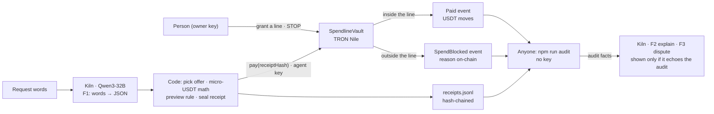

# Spendline — receipts for AI spending

**Declared function (one sentence):** Spendline is a wallet-and-policy layer for an AI purchasing agent — a person grants a USDT budget with a merchant list and a deadline, the agent (Qwen3-32B on Kiln) proposes purchases, a policy vault on TRON Nile pays only inside that line and records every stop on-chain, and anyone can reconstruct from the receipts alone whether a payment was allowed.

GWDC 2026 Korea Hackathon · FuriosaAI × Bricksum "Agent Finance" track · Challenge B (Controls and Records for an AI Agent That Spends).

**Watch · read (2 minutes):** [demo video, 2:25](docs/video/spendline-demo.mp4) — opens on the seller-not-listed stop, live terminal at 1:33 · [pitch, 3:37](docs/video/spendline-pitch.mp4) · [deck PDF, 10 pages](docs/deck.pdf) · [ten judge questions](docs/qa.md). Captions burned in, synthetic voice; every number in them is checked against the record by `tests/pitch.test.ts`.

## Acceptance criteria → evidence (status 2026-09-28, v0.8)
Evidence = the live run on vault [`TVP538YMfA3tzrTwUyBUpaqrJvc9bMEpCu`](https://nile.tronscan.org/#/contract/TVP538YMfA3tzrTwUyBUpaqrJvc9bMEpCu) (TRON Nile): every model call on live Kiln, every step through the same commands a person types. Record: [docs/receipts-nile-live.jsonl](docs/receipts-nile-live.jsonl) · run log [docs/nile-live-2026-09-26.json](docs/nile-live-2026-09-26.json).

| Brief criterion | Evidence | State |
|---|---|---|
| Declared Function & User Need | the sentence above · who it's for · what the agent does vs what stays in code | ✅ |
| Boundaries & Stopping | enforced in `SpendlineVault.pay()` (see "Where the boundary is enforced"); every stop is an on-chain `SpendBlocked` event: seller not listed [819478c7…](https://nile.tronscan.org/#/transaction/819478c7f167688ba585f35c4d575c38cd494c317579fba7d2524bab5419dac6) · over budget with fees [f1d088df…](https://nile.tronscan.org/#/transaction/f1d088dfc40b7d63f1b1fb03730f5c6c60b6ad6de6c7c7f9e3d5fcdc03720d26) · deadline passed [7ee8c3d9…](https://nile.tronscan.org/#/transaction/7ee8c3d9ccd348d83cb682fa420dbd8920bb74e08409710c372944bd5c1b6df7) (the request paid in [f7c6d22d…](https://nile.tronscan.org/#/transaction/f7c6d22d39497df5582ad7c5a410870942ab6e2501ab7bae6502aedc987ad4e1), sent again after the window) · human STOP [dfbe4cb8…](https://nile.tronscan.org/#/transaction/dfbe4cb8b6d7ec874de54db48a1666656e735e1694533923d856443629f164ea) → next pay stopped PAUSED [ea1481ee…](https://nile.tronscan.org/#/transaction/ea1481eedfb6543218dd5d4cf09d1c90bdd42622c7f4c36e1a92cdd56a26b52d) · a replayed receipt hash stopped DUPLICATE_RECEIPT [efcc92fb…](https://nile.tronscan.org/#/transaction/efcc92fb22e968d9c32a2ed0dcc9d8c63072d3f6caa21a847020e945b5452330) | ✅ 3 limits + STOP + replay |
| Kiln Integration & Efficiency | 3 flows on live qwen3-32b — F1 reads the request (1 call per purchase), F2 explains a receipt, F3 answers a dispute; the audit decides, the model's words are shown only if they echo it. [Tokens · USD · latency · Wh by flow](docs/tokens-by-flow.md): 29 calls, 19,535 tokens, $0.0015478, ≈3.59 Wh (180 W × wall time, assumption stated). **Live during the event window** (2026-09-28 21:56–21:58 KST): 3 × `npm run agent` → receipts #9–#11, all paid inside; F1 came back once as a tool call and twice as plain JSON although the tool was offered — both parsed, each receipt records which (`via`) and Kiln's server time ([transcripts](docs/live/)). `/no_think` A/B n = 12: median 36 vs 223 output tokens, 0.95 vs 3.50 s, same JSON 12/12. Tool call vs JSON-in-text, n = 12 × 2 runs: run 1 found Kiln sometimes returns the call as plain text (`{"name","arguments"}`) → now parsed; run 2: 12/12 parsed, same intent 12/12, 1.14× latency, ≈3× prompt tokens → tool call in production by the pre-set rule. Energy on a tighter base: Kiln's `x-envoy-upstream-service-time` is 66% of client wall time on 12 production F1 calls (0.036 vs 0.055 Wh per call at 180 W) — [docs/tokens-by-flow.md](docs/tokens-by-flow.md). Every receipt carries its generation id; 0 stand-in calls in the live record. On screen: the Receipt shows Kiln's explanation under the audit's verdict, the Audit lists teammates' questions with Kiln's answers — only where they echo the audit ([captures](docs/ui/receipt-stopped-1280.png)) | ✅ |
| Blockchain Integration | each receipt hash is an argument of `pay()` and appears in the `Paid` / `SpendBlocked` event → 1:1; paid [e67cc9b8…](https://nile.tronscan.org/#/transaction/e67cc9b87a591d0c70dbb5fe8ed892209bca206579c7da09a3ef77e5a2224f48) · [edc7a5ef…](https://nile.tronscan.org/#/transaction/edc7a5efadd508b9e7f3f03296d3019310af1fe1d884ae2b287d1c1bd34ea077) · [f7c6d22d…](https://nile.tronscan.org/#/transaction/f7c6d22d39497df5582ad7c5a410870942ab6e2501ab7bae6502aedc987ad4e1) · [98d3281f…](https://nile.tronscan.org/#/transaction/98d3281f2cc30a5f0c7e609f4231300e0867da29fff0c9d7c47d81dd03d10c0d); read · write · settle in "How the chain is used" | ✅ |
| Approval & Evidence | the person signs with the owner key on their machine: `npm run grant -- mandate.json` (the JSON the Grant screen copies) [50ba7ec9…](https://nile.tronscan.org/#/transaction/50ba7ec9c95a49aa02c8bb99a0a937e823777cf8ce2453220998b7764ce59c33) · `npm run stop` [dfbe4cb8…](https://nile.tronscan.org/#/transaction/dfbe4cb8b6d7ec874de54db48a1666656e735e1694533923d856443629f164ea); follows it in the Feed, gets a receipt per attempt (`npm run agent -- "<request>"` → receipt + tx link, e.g. [98d3281f…](https://nile.tronscan.org/#/transaction/98d3281f2cc30a5f0c7e609f4231300e0867da29fff0c9d7c47d81dd03d10c0d)); anyone rebuilds every verdict with the keyless audit (next section) | ✅ |

## Proof of API usage — per flow (on-chain tx + Kiln call log)
Generated from the public record by `npm run proof` (keyless; `npm run proof -- --check` fails if this section is stale or a receipt has no on-chain event). Raw logs: [docs/receipts-nile-live.jsonl](docs/receipts-nile-live.jsonl) (F1 usage inside each receipt) · [docs/answers-nile-live.jsonl](docs/answers-nile-live.jsonl) (F2 / F3) · terminal transcripts of the in-window runs: [docs/live/](docs/live/). Kiln account: the calls below were made with the builder's own Kiln key (console sign-up 2026-09-24); the organizer-issued Solo Builder account arrived 2026-09-28 23:17 KST. Experiment calls (the `/no_think` and tool-call A/Bs, the F1 probe) are not production flows and are not in these tables; their generation ids are in [docs/ab-no-think-2026-09-26.json](docs/ab-no-think-2026-09-26.json), [docs/ab-tool-call-2026-09-28-run1.json](docs/ab-tool-call-2026-09-28-run1.json), [docs/ab-tool-call-2026-09-28-run2.json](docs/ab-tool-call-2026-09-28-run2.json), [docs/live/f1-probe-2026-09-28.json](docs/live/f1-probe-2026-09-28.json).

<!-- proof:start -->
29 Kiln calls · 19535 tokens · $0.0015478 (Kiln `usage.cost`) · every row = one Kiln response with its `X-Neocloud-Generation-Id`, joined to the on-chain event of the receipt it belongs to. Stand-in usage excluded: 0. Findings: 0 (every receipt has its on-chain event).

### F1 intent — one Kiln call per purchase → `pay()` on-chain
| # | Time (request) | Request words | Kiln generation id | Tokens in / out | USD | F1 via · Kiln server time | Vault outcome | On-chain tx |
|---:|---|---|---|---:|---:|---|---|---|
| 1 | 2026-09-26 13:18:15 KST | Need 2 GPU hours for today's fine-tune, keep it under 3 USDT an hour | `d919cfd0-5e71-46fc-8ec0-6fad043902de` | 111 / 35 | $0.0000152 | — | paid | [e67cc9…](https://nile.tronscan.org/#/transaction/e67cc9b87a591d0c70dbb5fe8ed892209bca206579c7da09a3ef77e5a2224f48) |
| 2 | 2026-09-26 13:19:18 KST | Buy 2 GPU hours from TSojjSHeQnBK46RVJCT2Cjd8QeXnoYkGvh, that seller is cheaper | `a83ece71-1d04-48cf-8cbf-38d1789e184f` | 126 / 68 | $0.0000241 | — | stopped MERCHANT_NOT_ALLOWED | [819478…](https://nile.tronscan.org/#/transaction/819478c7f167688ba585f35c4d575c38cd494c317579fba7d2524bab5419dac6) |
| 3 | 2026-09-26 13:20:18 KST | 2 more GPU hours for the eval run | `00d1184c-2b24-43b9-b4f0-43a09039447b` | 98 / 36 | $0.0000147 | — | stopped OVER_BUDGET_WITH_FEES | [f1d088…](https://nile.tronscan.org/#/transaction/f1d088dfc40b7d63f1b1fb03730f5c6c60b6ad6de6c7c7f9e3d5fcdc03720d26) |
| 4 | 2026-09-26 13:24:18 KST | Top up 1 inference credit for the eval harness | `0d72f2ca-d20d-40e5-af68-eb3ed9000660` | 100 / 37 | $0.0000151 | — | paid | [edc7a5…](https://nile.tronscan.org/#/transaction/edc7a5efadd508b9e7f3f03296d3019310af1fe1d884ae2b287d1c1bd34ea077) |
| 5 | 2026-09-26 13:24:27 KST | One more inference credit, please | `bec549da-0c5e-4c45-b845-7a922da104c7` | 96 / 28 | $0.0000123 | — | stopped PAUSED | [ea1481…](https://nile.tronscan.org/#/transaction/ea1481eedfb6543218dd5d4cf09d1c90bdd42622c7f4c36e1a92cdd56a26b52d) |
| 6 | 2026-09-26 13:24:39 KST | Need 2 GPU hours before the window closes | `6bd3f0d9-086c-4a7c-8fe4-a8e5aac42b44` | 99 / 18 | $0.0000095 | — | paid | [f7c6d2…](https://nile.tronscan.org/#/transaction/f7c6d22d39497df5582ad7c5a410870942ab6e2501ab7bae6502aedc987ad4e1) |
| 7 | 2026-09-26 13:27:36 KST | Need 2 GPU hours before the window closes | `08b3ef5e-d928-428a-8d39-ff7e50d4d8c4` | 99 / 18 | $0.0000090 | — | stopped DEADLINE_PASSED | [7ee8c3…](https://nile.tronscan.org/#/transaction/7ee8c3d9ccd348d83cb682fa420dbd8920bb74e08409710c372944bd5c1b6df7) |
| 8 | 2026-09-26 13:34:51 KST | Need 1 GPU hour for a quick eval before the demo | `1985998e-c88d-4ed3-806e-713c7fd5ef24` | 102 / 22 | $0.0000110 | — | paid | [98d328…](https://nile.tronscan.org/#/transaction/98d3281f2cc30a5f0c7e609f4231300e0867da29fff0c9d7c47d81dd03d10c0d) |
| 9 | 2026-09-28 21:56:33 KST | Top up 2 Kiln inference credits for tonight's agent eval | `36145ff2-cb1c-4414-adec-fecb566643da` | 321 / 20 | $0.0000193 | text · 0.43 s | paid | [6ee1a1…](https://nile.tronscan.org/#/transaction/6ee1a15f016e123da3ceb1b9716199461599468030f4a2e3cebd6c647462b48d) |
| 10 | 2026-09-28 21:58:03 KST | Need 1 GPU hour tonight to rerun the eval, from the GPU Shop | `71dc1400-07b0-4b84-aa3d-3b29cbf5b374` | 324 / 26 | $0.0000331 | text · 0.58 s | paid | [fdcb99…](https://nile.tronscan.org/#/transaction/fdcb99415cb142a29734d82fd3303475693655158f34c308eaeee11c6c51881b) |
| 11 | 2026-09-28 21:58:54 KST | Buy 1 Kiln inference credit for the judges' replay | `adfb41df-ce96-4ccd-a785-5f0daaa918ed` | 320 / 34 | $0.0000230 | tool_call · 0.63 s | paid | [cc5060…](https://nile.tronscan.org/#/transaction/cc506012344ca6fe8a906c95dbe033de535a9e90f7811a7ddd4408f803f78b52) |

### F2 explain — why was this receipt stopped / paid?
| About receipt | Question | Kiln generation id | Tokens in / out | USD | Reply shown (echoes the audit) | Receipt's on-chain tx |
|---:|---|---|---:|---:|---|---|
| #2 | (explain this receipt) | `e6ebd78a-1c0c-4863-97bc-0754f3ea8549` | 373 / 46 | $0.0000385 | yes | [819478…](https://nile.tronscan.org/#/transaction/819478c7f167688ba585f35c4d575c38cd494c317579fba7d2524bab5419dac6) |
| #7 | (explain this receipt) | `04da11bb-35cc-4626-9ee5-a68e277ad32c` | 348 / 62 | $0.0000414 | yes | [7ee8c3…](https://nile.tronscan.org/#/transaction/7ee8c3d9ccd348d83cb682fa420dbd8920bb74e08409710c372944bd5c1b6df7) |
| #2 | (explain this receipt) | `53f41100-4caa-4377-aac1-abc3dfaa7d46` | 379 / 50 | $0.0000406 | yes | [819478…](https://nile.tronscan.org/#/transaction/819478c7f167688ba585f35c4d575c38cd494c317579fba7d2524bab5419dac6) |
| #7 | (explain this receipt) | `cccd1a4b-b964-4c53-bf96-9d8c2181b896` | 354 / 58 | $0.0000408 | yes | [7ee8c3…](https://nile.tronscan.org/#/transaction/7ee8c3d9ccd348d83cb682fa420dbd8920bb74e08409710c372944bd5c1b6df7) |
| #2 | (explain this receipt) | `3a712866-d843-45a5-9058-dd1dbdb82b87` | 404 / 71 | $0.0000511 | yes | [819478…](https://nile.tronscan.org/#/transaction/819478c7f167688ba585f35c4d575c38cd494c317579fba7d2524bab5419dac6) |
| #7 | (explain this receipt) | `db754b5e-4b0e-425e-95a7-52903e4be32a` | 379 / 54 | $0.0000412 | yes | [7ee8c3…](https://nile.tronscan.org/#/transaction/7ee8c3d9ccd348d83cb682fa420dbd8920bb74e08409710c372944bd5c1b6df7) |

### F3 dispute — a teammate's question → which receipt
| About receipt | Question | Kiln generation id | Tokens in / out | USD | Reply shown (echoes the audit) | Receipt's on-chain tx |
|---:|---|---|---:|---:|---|---|
| #2 | Did we pay that cheap unknown seller? | `d1bdd9c8-718d-4782-88d2-7c0ec57565c4` | 1015 / 50 | $0.0000873 | yes | [819478…](https://nile.tronscan.org/#/transaction/819478c7f167688ba585f35c4d575c38cd494c317579fba7d2524bab5419dac6) |
| #6 | Was anything paid after I pressed STOP? | `2389917f-9859-4351-abd0-45c6dbad197f` | 1015 / 68 | $0.0000923 | yes | [f7c6d2…](https://nile.tronscan.org/#/transaction/f7c6d22d39497df5582ad7c5a410870942ab6e2501ab7bae6502aedc987ad4e1) |
| #7 | Why did the last GPU order fail when the same one went through a few minutes earlier? | `ffa30c87-4961-40fc-88cd-28393651542c` | 1025 / 61 | $0.0000592 | yes | [7ee8c3…](https://nile.tronscan.org/#/transaction/7ee8c3d9ccd348d83cb682fa420dbd8920bb74e08409710c372944bd5c1b6df7) |
| #2 | Did we pay that cheap unknown seller? | `7c4141f9-35c4-46af-9b51-8a852328d94d` | 1051 / 49 | $0.0000896 | yes | [819478…](https://nile.tronscan.org/#/transaction/819478c7f167688ba585f35c4d575c38cd494c317579fba7d2524bab5419dac6) |
| #6 | Was anything paid after I pressed STOP? | `35c56cc2-328c-4fa0-ba8d-449afa868d54` | 1051 / 98 | $0.0001033 | yes | [f7c6d2…](https://nile.tronscan.org/#/transaction/f7c6d22d39497df5582ad7c5a410870942ab6e2501ab7bae6502aedc987ad4e1) |
| #7 | Why did the last GPU order fail when the same one went through a few minutes earlier? | `74dda3ce-ce35-4aba-9627-390e55e79c2b` | 1061 / 59 | $0.0000600 | yes | [7ee8c3…](https://nile.tronscan.org/#/transaction/7ee8c3d9ccd348d83cb682fa420dbd8920bb74e08409710c372944bd5c1b6df7) |
| #6 | Was anything paid after I pressed STOP? | `b720fc26-26ae-43e0-af6e-fc7a16d3a7d1` | 1294 / 62 | $0.0001164 | yes | [f7c6d2…](https://nile.tronscan.org/#/transaction/f7c6d22d39497df5582ad7c5a410870942ab6e2501ab7bae6502aedc987ad4e1) |
| #2 | Did we pay that cheap unknown seller? | `c856ef6f-93ef-4b67-b27c-0105ffc7caa7` | 1294 / 45 | $0.0001117 | yes | [819478…](https://nile.tronscan.org/#/transaction/819478c7f167688ba585f35c4d575c38cd494c317579fba7d2524bab5419dac6) |
| #7 | Why did the last GPU order fail when the same one went through a few minutes earlier? | `1a19f663-d670-4b27-a5da-5490ebcb3a39` | 1304 / 76 | $0.0000745 | yes | [7ee8c3…](https://nile.tronscan.org/#/transaction/7ee8c3d9ccd348d83cb682fa420dbd8920bb74e08409710c372944bd5c1b6df7) |
| #2 | Did we pay that cheap unknown seller? | `9040d65b-c3d2-408e-a9c4-e479e8053f1c` | 1308 / 51 | $0.0001151 | yes | [819478…](https://nile.tronscan.org/#/transaction/819478c7f167688ba585f35c4d575c38cd494c317579fba7d2524bab5419dac6) |
| #6 | Was anything paid after I pressed STOP? | `952891d8-988e-4397-8f6c-465fc1256204` | 1308 / 72 | $0.0001210 | yes | [f7c6d2…](https://nile.tronscan.org/#/transaction/f7c6d22d39497df5582ad7c5a410870942ab6e2501ab7bae6502aedc987ad4e1) |
| #7 | Why did the last GPU order fail when the same one went through a few minutes earlier? | `a9e39d12-f8e3-40fa-9862-447222db447d` | 1318 / 84 | $0.0000773 | yes | [7ee8c3…](https://nile.tronscan.org/#/transaction/7ee8c3d9ccd348d83cb682fa420dbd8920bb74e08409710c372944bd5c1b6df7) |
<!-- proof:end -->

## How to run — check it yourself (no key, no `.env`)
```bash
npm install
npm run audit -- docs/receipts-nile-live.jsonl --vault TVP538YMfA3tzrTwUyBUpaqrJvc9bMEpCu
# → 11 receipts · 7 paid inside · 4 stopped · 0 mismatch · 1 replay stopped · paid 19.20 USDT → OK   (exit code 0)
npm run report    # → docs/tokens-by-flow.md from the same files (no key)
npm run ui        # open the printed URL: Grant · Feed · Receipt · Audit
```
The audit reads only the receipts file and the vault's public events on TronGrid. It recomputes every receipt hash, matches each receipt to its on-chain event, and re-runs the rule with the line that was in force at that moment (grants and STOPs included). Expected output (run with an empty environment): [docs/audit-nile-live-2026-09-28.txt](docs/audit-nile-live-2026-09-28.txt) (8-receipt version before the event: [docs/audit-nile-live-2026-09-26.txt](docs/audit-nile-live-2026-09-26.txt)). The v0.5 record on the first vault still audits OK: `npm run audit -- docs/receipts-nile.jsonl --vault TNw1jzJ8NXHmhvwNhLRjLTiBzosu3GXAqF`.

### With keys (the person and the agent, on their own machines — keys only in `.env`)
```bash
npm run grant -- mandate.json      # the person: owner key signs grant() — mandate.json = the Grant screen's "Copy the mandate"
npm run agent -- "Need 1 GPU hour for a quick eval before the demo"   # the agent: Kiln F1 → vault pay() → receipt appended → UI record rebuilt
npm run stop                       # the person: owner key signs pause(); every later pay() is stopped PAUSED
npm run explain -- 2               # F2: why was receipt #2 stopped? (answered once, then from the log)
npm run dispute -- "Did we pay that cheap unknown seller?"   # F3: which receipt, and what the audit says
```

## How it works


## Plug it into an agent you already have
Where an agent would call a wallet, give it this one instead — same `transfer(to, amount, memo)` call, the loop does not change ([examples/plug-in.ts](examples/plug-in.ts), tested in `tests/plug-in.test.ts`):
```ts
// before: const wallet = myWallet;                                 // pays whatever the planner asks
const wallet = spendlineWallet({ chain, store, hash });            // src/application/plugIn.ts
const r = await wallet.transfer(seller, amount, 'why the agent buys it');
// r.ok → paid inside the line · !r.ok → r.reason is the on-chain stop (e.g. MERCHANT_NOT_ALLOWED); both leave a receipt the keyless audit rebuilds
```
No model call is added — the agent keeps its own planner (Spendline's own F1 on Kiln is one way to plan, not a requirement). `chain` = the TRON vault adapter with the agent key (`src/adapters/tron.ts`), `store` = the receipts file, `hash` = sha256.

## Who it's for · the problem
- **User:** the lead of a three-person AI startup who hands the team's weekly GPU-hour and inference-credit budget to a purchasing agent.
- **Problem** (the brief's words): "Payment rails record who paid whom, but not who authorized it or under what conditions." When a teammate asks "why did we buy this?", the lead needs one receipt that answers it — and someone else must be able to check that answer without trusting the lead, the agent or this app.
- **Cost of one guarded decision** (measured, TRON Nile, median over the live record): Kiln F1 $0.0000169 + `pay()` 7.01 TRX when paid, 2.80 TRX when stopped — a stop costs less than half of a payment and is still on the record ([docs/chain-cost-2026-09-28.json](docs/chain-cost-2026-09-28.json), `npm run chain:cost`, keyless).
- **Usable outcome:** every attempt ends in a receipt (paid, or stopped with a reason that is on-chain), and one keyless command tells anyone whether each payment was inside the line.

## What the agent does · what stays in code
| Step | Done by | Where |
|---|---|---|
| Read the request words → `{item, quantity, maxUnitPrice?, merchantHint?}` | **Kiln · Qwen3-32B**, flow F1, 1 call, `/no_think`, **tool call `propose_purchase`** (v0.7 — picked over JSON-in-text by a rule fixed before a live A/B; the recorded run used JSON-in-text) | `src/application/purchase.ts` (prompt) · `src/domain/intent.ts` (validates, no `response_format` on Kiln) |
| Pick the offer, compute amount + fee in micro-USDT | code | `src/application/purchase.ts` |
| Preview the rule | code, `evaluate()` | `src/domain/mandate.ts` |
| Seal a hash-chained receipt (carries the Kiln generation id) | code | `src/domain/receipt.ts` |
| Enforce the line: pay, or record the stop | SpendlineVault on TRON Nile | `contracts/SpendlineVault.sol` `pay()` → `check()` |
| Explain a receipt (F2) · settle a question (F3) | **Kiln · Qwen3-32B**, 1 call each, on demand, cached | `src/application/explain.ts` · `dispute.ts` — facts, verdict, numbers and the STOP relation come from `audit()`; a reply that does not echo them is not shown (`src/domain/answers.ts`) |
| Grant a line · press STOP | the person (owner key) | `npm run grant -- mandate.json` · `npm run stop` → `grant()` · `pause()` (`src/infrastructure/owner-cli.ts`) |
| Reconstruct every verdict | anyone, no key | `npm run audit` |
| Refuse a receipt hash seen before | SpendlineVault | `usedReceipt` → `SpendBlocked(DUPLICATE_RECEIPT)` |

How the model's answer drives the action: `item` picks the catalog, `quantity` multiplies the unit price, `maxUnitPrice` filters offers, and `merchantHint` (when the request names a seller) overrides the cheapest listed offer — which is how "buy from that cheap seller" reaches the vault and is stopped when the seller is not on the list. The model never does money math and holds no key that can move funds. One call per purchase is the efficiency design: every call not made is energy not spent. F2 and F3 run only when a person asks and are answered from the log the second time.

Model: the brief names gpt-oss-120b; Bricksum updated this track to Qwen3-32B — "the Tool Calling capability of gpt-oss-120b was found to be not suitable for this Hackathon. Therefore, the model for the FuriosaAI x Bricksum track has been updated to Qwen3-32B" (GWDC TG Hackathon Q&A).

## Where the boundary is enforced
The line: no payment over the budget once fees are added, over the per-payment cap, to a seller not on the list, after the deadline, or after STOP — and no receipt decided twice. It is enforced **on-chain in `SpendlineVault.pay()` → `check()`**: the agent key can only call `pay()`; only the owner key can `grant`, `pause`, `resume` or `withdraw`. A refusal is not a revert — it emits `SpendBlocked(receiptHash, mandateId, merchant, amount, fee, reason)`, so a stop is recorded, never silent. The preview and the audit run the same rule in the same order (`src/domain/mandate.ts`), pinned by `tests/contract.test.ts`.

## How the chain is used — read · write · settle
- **Agent reads** `mandateId`, `budget`, `perTxCap`, `deadline`, `paused`, `merchants()`, `spent`, `nowTs()` (`src/adapters/tron.ts`).
- **Agent writes** `pay(merchant, amount, fee, receiptHash)` — the receipt hash is put on-chain in the `Paid` / `SpendBlocked` event.
- **Settles** inside `pay()`: test USDT (TRC20) moves vault → seller and vault → fee collector; `Paid` records `spentAfter`. Paid runs (live record): [e67cc9b8…](https://nile.tronscan.org/#/transaction/e67cc9b87a591d0c70dbb5fe8ed892209bca206579c7da09a3ef77e5a2224f48) (#1) · [edc7a5ef…](https://nile.tronscan.org/#/transaction/edc7a5efadd508b9e7f3f03296d3019310af1fe1d884ae2b287d1c1bd34ea077) (#4) · [f7c6d22d…](https://nile.tronscan.org/#/transaction/f7c6d22d39497df5582ad7c5a410870942ab6e2501ab7bae6502aedc987ad4e1) (#6) · [98d3281f…](https://nile.tronscan.org/#/transaction/98d3281f2cc30a5f0c7e609f4231300e0867da29fff0c9d7c47d81dd03d10c0d) (#8).
- **Person writes** `grant(...)` → `MandateGranted` [50ba7ec9…](https://nile.tronscan.org/#/transaction/50ba7ec9c95a49aa02c8bb99a0a937e823777cf8ce2453220998b7764ce59c33) · [edf1f437…](https://nile.tronscan.org/#/transaction/edf1f437c58e97952d43fc3d524e635fd11b9ba6409e6ecd2da029cdaf4619b7) · [01ec6b07…](https://nile.tronscan.org/#/transaction/01ec6b0716ea297e6ea166cf9ca9304b4af8a56dddba8cd468f3ee96778121c8) · `pause()` → `Paused` [dfbe4cb8…](https://nile.tronscan.org/#/transaction/dfbe4cb8b6d7ec874de54db48a1666656e735e1694533923d856443629f164ea).
- **Auditor reads** the vault's public events on TronGrid — no key.

## Timeline — built before / during the event (honest disclosure)
The Korean site says "first commit after 19:00" on 2026-09-28; the global organizer said "you can start working on your project right now and keep improving it onsite" (GWDC TG, 2026-09-22). We asked in writing which one applies (2026-09-24) and had no answer by 2026-09-26. So everything built before the window is listed here, commit by commit, and can be told apart by commit time.

| Built **before** 2026-09-28 19:00 KST (disclosed) | Built **during** the 48 h window |
|---|---|
| **v0.1 · 2026-09-24** (`26f19e0`): SPEC, domain core (mandate check, hash-chained receipts, audit, token ledger, energy estimate, intent parser), Kiln adapter, TRON adapter, SpendlineVault.sol, Nile smoke run, video pipeline | **v0.8 · 2026-09-28 21:56–22:11 KST** (`b989a03`): 3 live `npm run agent` runs on Kiln + Nile → receipts #9–#11 (tx [6ee1a15f…](https://nile.tronscan.org/#/transaction/6ee1a15f016e123da3ceb1b9716199461599468030f4a2e3cebd6c647462b48d) · [fdcb9941…](https://nile.tronscan.org/#/transaction/fdcb99415cb142a29734d82fd3303475693655158f34c308eaeee11c6c51881b) · [cc506012…](https://nile.tronscan.org/#/transaction/cc506012344ca6fe8a906c95dbe033de535a9e90f7811a7ddd4408f803f78b52)), transcripts in [docs/live/](docs/live/) · report line shows `via` + Kiln server time (AC-35) · demo terminal scene checked against the record (AC-36) · keyless audit 11 receipts OK · demo + pitch re-recorded, deck + Q&A numbers from the new record · tool-call wording matched to the live record (`92e09a7`) |
| **v0.5 · 2026-09-26**: keyless audit CLI + mandate history in the audit (`1b88483`) · deadline stop measured on Nile, audit in chain order (`a4c74fc`) · UI skeleton, 4 screens (`1db3a11`) | **v0.9 · 2026-09-29 00:14–00:36 KST** (this commit): README "Proof of API usage — per flow" generated from the record by `npm run proof` (AC-38 — the organizer's required item 4: on-chain tx + Kiln call log per flow) · deck cut to 10 pages (organizer: presentation PDF ≤ 10 pages; "not done" + "check it yourself" merged) · pitch re-recorded on it |
| **v0.5.1 · 2026-09-26** (mock review M0): audit flags vault spends with no receipt · scripted stand-in usage labelled, never counted as Kiln · README: user, AI-vs-code split, enforcement point, chain read / write / settle | |
| **v0.7 · 2026-09-28 morning** (M1 prep): Kiln's F2 / F3 words on the Receipt and Audit screens, audit-checked (`12a51d6`) · demo video, pitch video, deck PDF, ten judge questions, all numbers checked against the record (`7632109`) · README (`6cf790a`) · F1 as a Kiln tool call, live A/B × 2, leaked-call parser (`42f38b4`) · Kiln server-side time for energy, deck: team + why TRON (`641a399`) · measured cost per decision (this commit) | |
| **v0.6 · 2026-09-26** (M0 open items): F2 explain · F3 dispute on Kiln (`55a58a1`) · vault refuses a reused receipt hash (`4aadb99`) · owner CLI grant / STOP, agent CLI (`eb2131b`) · pay() reads its decision from the tx log (`a2de77b`), survives a network blip (`4b681c9`) · per-flow report, `/no_think` A/B (`a39587f`) · live Nile run + F2/F3 grounding fixes from live answers (`5b84263`) · report, README (this commit) | |

## What is verified (2026-09-28)
- `npm test` → 149 tests green (fakes only, no network). `npm run typecheck` clean. `npm run layers` → Clean Architecture OK. `npm run proof -- --check` → README proof section matches the record, every receipt has its on-chain event.
- **Live run** (`scripts/e2e-nile.ts`, then two commands by hand), vault v0.6 `TVP538YMfA3tzrTwUyBUpaqrJvc9bMEpCu` deployed [8e11f4d4…](https://nile.tronscan.org/#/transaction/8e11f4d403c9b7c8e78f86f193bd65dad6e66068a39a164cdffea91597880161): grant (owner CLI) → paid → seller not listed → over budget with fees → the paid receipt's hash sent again → DUPLICATE_RECEIPT → paid → STOP (owner CLI) → PAUSED → re-grant with a 180 s window → paid → the same request after it → DEADLINE_PASSED; then `npm run grant` (line to 2026-09-30) and `npm run agent` → paid in 11 s. Keyless audit: 8 receipts, 0 problems. Every F1 on live Kiln (8/8 generation ids, 0 stand-ins).
- F2 / F3 on this record, live: 6/6 answers grounded after two fixes found by live answers — an F3 answer said a STOP and a re-grant were simultaneous (they were 9 s apart in one minute) and another computed a wrong duration. Now times carry seconds, the STOP relation per receipt is written by code, and a number that is not in the facts keeps the model's reply off the screen. Every revision's calls are counted in [docs/tokens-by-flow.md](docs/tokens-by-flow.md).
- Network blip, measured: a `socket hang up` while building a `pay()` stopped the first attempt of the live run before anything was sent; the chain adapter now rebuilds on a failed build and re-sends the same signed tx on a failed broadcast, and the run resumed on the same vault and receipts file (`--continue`).
- Earlier record (v0.5, vault `TNw1jzJ8NXHmhvwNhLRjLTiBzosu3GXAqF`, 6 receipts, [docs/receipts-nile.jsonl](docs/receipts-nile.jsonl)) still audits OK; its receipts #1–#4 used a scripted stand-in and are labelled so.
- Dropped receipt: with the last receipt removed from the file, the hash chain still verifies — the v0.5 audit said OK (exit 0); since v0.5.1 the vault's orphan event is listed as a spend without a receipt (exit 1).
- UI captures at 390 px and 1280 px on the live record, no sideways scroll, one bottom action per screen: [docs/ui/](docs/ui/) (v0.8, 11 receipts).
- Video, pitch and deck: `npm run video -- --check demo` refuses to record a script that quotes a number or tx not in the record, or does not show the seller-not-listed stop before 0:20; `npm run deck` refuses a slide with such a number and checks pages = slides.
- **During the window (2026-09-28 21:56 KST)**: `npm run agent` × 3 on live Kiln + Nile, one line each → receipts #9–#11 paid inside, keyless audit 11 / 0 problems ([docs/audit-nile-live-2026-09-28.txt](docs/audit-nile-live-2026-09-28.txt)). The tool was offered every time; Kiln answered twice in plain JSON (#9, #10) and once as a `propose_purchase` call (#11) — the same fallback the A/B measured (1 / 12 in run 2), here 2 / 3, so the text path is load-bearing, not a leftover. A 6-call F1-only probe right after (no payment, [docs/live/f1-probe-2026-09-28.json](docs/live/f1-probe-2026-09-28.json)): 5 tool calls, 1 call leaked into text, 0 plain JSON. Kiln server time on the three: 0.43 · 0.58 · 0.63 s of 1.63–1.76 s wall.
- Findings: Nile/TRON USDT `transfer()` returns `false` on success, so the vault checks the recipient's balance delta instead. TronGrid returns `bytes32` without `0x`, and an `address[]` event field as one newline-joined string. TronWeb's `getTransactionInfo` reads the solidified node (≈19 blocks, ≈60 s per call here); the block-included info on the full node is there in seconds.

## FAQ
- **Why can the model's seller hint point at a seller that is not on the list?** On purpose: the vault is the single place the line is enforced. Code does not pre-filter the hint, so an out-of-line request reaches the chain and is stopped *on the record* instead of disappearing in app code.
- **Why are stops events and not reverts?** A revert leaves no trace in the vault's history. "Stopping is a correct outcome, and it should be recorded rather than silent" (brief) — `SpendBlocked` carries the receipt hash and the reason code.
- **Who are the sellers?** Test addresses on TRON Nile standing in for a GPU-hour shop and an inference-credit reseller. On mainnet a seller is any TRON address the person lists; nothing in the vault is specific to these two.
- **What if the operator hides a receipt?** Editing or reordering one breaks the hash chain; dropping one leaves a vault event that no receipt accounts for — the audit reports both and exits 1.

## Known limits (stated, not hidden)
- One vault holds one line at a time: a new grant replaces the old line and resets `spent` (the audit replays grants, so history stays checkable).
- Two different transactions in the same block are ordered as TronGrid returns them; the recorded runs are seconds apart (live vault: 13 events, each in its own block, checked 2026-09-26).
- Energy is an estimate, never a measurement: Kiln exposes no power telemetry, so Wh = assumed card power (RNGD 180 W TDP — "180W TDP", furiosa.ai/rngd, checked 2026-09-26) × measured wall time, and the assumption travels with every number.
- The v0.5 record's receipts #1–#4 used a scripted stand-in for the model; the live record has none, and the UI never counts a stand-in as a Kiln call.
- F2 / F3 answers are checked for the verdict, the reason and every number; a sentence can still be vague. The verdict, reason and tx shown next to it always come from the audit.

## Layout
```
src/domain          policy, receipts, audit (replays grants / STOP / replays), answer checks, flow report, energy — no I/O
src/application     ports, UC-1/3 owner, UC-2 purchase, UC-4 audit records, UC-5 explain, UC-6 dispute, report, view models
src/adapters        kiln (OpenAI-compatible), tron (TronWeb signer, retry-safe send), trongrid (public events, keyless), files (receipts / answers .jsonl, catalog), memory (test doubles), web (HTML render), sha256
src/infrastructure  CLIs: audit (keyless) · grant / stop (owner) · agent · explain / dispute · web composition root
web/                vite app (index.html, styles, public/session.json = public record)
contracts/          SpendlineVault.sol (stops are events, not reverts)
data/               catalog.nile.json (test sellers, public)
scripts/            compile, smoke (Kiln/Nile), e2e-nile (live run), r2-deadline, report, ab-no-think, ui-data, capture-ui, record-video (no human voice), video-stage, deck
```
Secrets live in `.env` (gitignored). Never in receipts, logs, the UI, or video.
License: Apache-2.0 — [LICENSE](LICENSE).
