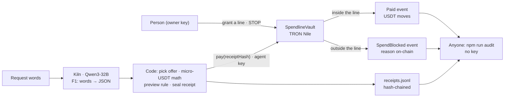

# Spendline — receipts for AI spending

**Declared function (one sentence):** Spendline is a wallet-and-policy layer for an AI purchasing agent — a person grants a USDT budget with a merchant list and a deadline, the agent (Qwen3-32B on Kiln) proposes purchases, a policy vault on TRON Nile pays only inside that line and records every stop on-chain, and anyone can reconstruct from the receipts alone whether a payment was allowed.

GWDC 2026 Korea Hackathon · FuriosaAI × Bricksum "Agent Finance" track · Challenge B (Controls and Records for an AI Agent That Spends).

## Acceptance criteria → evidence (status 2026-09-26, v0.5.1)
| Brief criterion | Evidence | State |
|---|---|---|
| Declared Function & User Need | the sentence above · who it's for · what the agent does vs what stays in code | ✅ |
| Boundaries & Stopping | enforced in `SpendlineVault.pay()` (see "Where the boundary is enforced"); every stop is an on-chain `SpendBlocked` event: seller not listed [dfabe354…](https://nile.tronscan.org/#/transaction/dfabe354f7f527177d29f085c326b90752e69e1f2214cf629627409bbf6f601b) · over budget with fees [9a1fe129…](https://nile.tronscan.org/#/transaction/9a1fe129669d67089d36146fdeaff37a49a0414dc6d028447174deb928e6f64a) · deadline passed [ec20af5a…](https://nile.tronscan.org/#/transaction/ec20af5a007307c69565c6c159f6af8fe063d2a3b30238c9c161d300e3292bc1) · human STOP [488996ee…](https://nile.tronscan.org/#/transaction/488996eef9ecdc35f53004ccb1f7b5b1d43484fc84ebb9a7bf6a154f382a0721) → next pay stopped PAUSED [5c91105e…](https://nile.tronscan.org/#/transaction/5c91105ed9d0cd49ea8822ab0d30f3d5d9a34232f8020096d658befede01cffc) | ✅ 3 limits + 1 STOP |
| Kiln Integration & Efficiency | F1 (intent) live on qwen3-32b in receipts #5–#6: 1 call per purchase, 104 prompt + 37–41 output tokens, 1.5–3.3 s, generation id sealed in the receipt; `/no_think` 57 vs 250 tokens (n = 1). Receipts #1–#4 (2026-09-24 template smoke) used a **scripted stand-in** for the model — marked `fake-N` in the receipt and labelled so in the UI | ◐ live Kiln on every run, per-flow table, A/B n ≥ 10 and Wh table at the event |
| Blockchain Integration | each receipt hash is an argument of `pay()` and appears in the `Paid` / `SpendBlocked` event → 1:1; read · write · settle and paid tx links in "How the chain is used" | ✅ |
| Approval & Evidence | keyless audit (next section) — also flags any vault spend that no receipt accounts for — + UI: grant a line, watch the feed, open a receipt, audit a file | ◐ Grant and STOP in the UI are not wired to a signer yet |

## Check it yourself — no key, no `.env`
```bash
npm install
npm run audit -- docs/receipts-nile.jsonl --vault TNw1jzJ8NXHmhvwNhLRjLTiBzosu3GXAqF
# → 6 receipts · 2 paid inside · 4 stopped · 0 mismatch → OK   (exit code 0)
npm run ui        # open the printed URL: Grant · Feed · Receipt · Audit
```
The audit reads only the receipts file and the vault's public events on TronGrid. It recomputes every receipt hash, matches each receipt to its on-chain event, and re-runs the rule with the line that was in force at that moment (grants and STOPs included). Expected output: [docs/audit-nile-2026-09-26.txt](docs/audit-nile-2026-09-26.txt).

## How it works


## Who it's for · the problem
- **User:** the lead of a three-person AI startup who hands the team's weekly GPU-hour and inference-credit budget to a purchasing agent.
- **Problem** (the brief's words): "Payment rails record who paid whom, but not who authorized it or under what conditions." When a teammate asks "why did we buy this?", the lead needs one receipt that answers it — and someone else must be able to check that answer without trusting the lead, the agent or this app.
- **Usable outcome:** every attempt ends in a receipt (paid, or stopped with a reason that is on-chain), and one keyless command tells anyone whether each payment was inside the line.

## What the agent does · what stays in code
| Step | Done by | Where |
|---|---|---|
| Read the request words → `{item, quantity, maxUnitPrice?, merchantHint?}` | **Kiln · Qwen3-32B**, flow F1, 1 call, `/no_think` | `src/application/purchase.ts` (prompt) · `src/domain/intent.ts` (validates, no `response_format` on Kiln) |
| Pick the offer, compute amount + fee in micro-USDT | code | `src/application/purchase.ts` |
| Preview the rule | code, `evaluate()` | `src/domain/mandate.ts` |
| Seal a hash-chained receipt (carries the Kiln generation id) | code | `src/domain/receipt.ts` |
| Enforce the line: pay, or record the stop | SpendlineVault on TRON Nile | `contracts/SpendlineVault.sol` `pay()` → `check()` |
| Grant a line · press STOP | the person (owner key) | `grant()` · `pause()` |
| Reconstruct every verdict | anyone, no key | `npm run audit` |

How the model's answer drives the action: `item` picks the catalog, `quantity` multiplies the unit price, `maxUnitPrice` filters offers, and `merchantHint` (when the request names a seller) overrides the cheapest listed offer — which is how "buy from that cheap seller" reaches the vault and is stopped when the seller is not on the list. The model never does money math and holds no key that can move funds. One call per purchase is the efficiency design: every call not made is energy not spent.

Model: the brief names gpt-oss-120b; Bricksum updated this track to Qwen3-32B — "the Tool Calling capability of gpt-oss-120b was found to be not suitable for this Hackathon. Therefore, the model for the FuriosaAI x Bricksum track has been updated to Qwen3-32B" (GWDC TG Hackathon Q&A).

## Where the boundary is enforced
The line: no payment over the budget once fees are added, over the per-payment cap, to a seller not on the list, after the deadline, or after STOP. It is enforced **on-chain in `SpendlineVault.pay()` → `check()`**: the agent key can only call `pay()`; only the owner key can `grant`, `pause`, `resume` or `withdraw`. A refusal is not a revert — it emits `SpendBlocked(receiptHash, mandateId, merchant, amount, fee, reason)`, so a stop is recorded, never silent. The preview and the audit run the same rule in the same order (`src/domain/mandate.ts`), pinned by `tests/contract.test.ts`.

## How the chain is used — read · write · settle
- **Agent reads** `mandateId`, `budget`, `perTxCap`, `deadline`, `paused`, `merchants()`, `spent`, `nowTs()` (`src/adapters/tron.ts`).
- **Agent writes** `pay(merchant, amount, fee, receiptHash)` — the receipt hash is put on-chain in the `Paid` / `SpendBlocked` event.
- **Settles** inside `pay()`: test USDT (TRC20) moves vault → seller and vault → fee collector; `Paid` records `spentAfter`. Paid runs: [14d696c3…](https://nile.tronscan.org/#/transaction/14d696c38d4aefa3503754093deef91e2a58ca876e839d7d05a69ee565ab393f) (#1) · [67bcc186…](https://nile.tronscan.org/#/transaction/67bcc186ae0af0fdf61060dc69ba2001361d414dd61130f8df58f406395b977d) (#5).
- **Person writes** `grant(...)` → `MandateGranted` · `pause()` → `Paused`.
- **Auditor reads** the vault's public events on TronGrid — no key.

## Timeline — built before / during the event (honest disclosure)
The Korean site says "first commit after 19:00" on 2026-09-28; the global organizer said "you can start working on your project right now and keep improving it onsite" (GWDC TG, 2026-09-22). We asked in writing which one applies (2026-09-24) and had no answer by 2026-09-26. So everything built before the window is listed here, commit by commit, and can be told apart by commit time.

| Built **before** 2026-09-28 19:00 KST (disclosed) | Built **during** the 48 h window |
|---|---|
| **v0.1 · 2026-09-24** (`26f19e0`): SPEC, domain core (mandate check, hash-chained receipts, audit, token ledger, energy estimate, intent parser), Kiln adapter, TRON adapter, SpendlineVault.sol, Nile smoke run, video pipeline | (filled at the event) |
| **v0.5 · 2026-09-26**: keyless audit CLI + mandate history in the audit (`1b88483`) · deadline stop measured on Nile, audit in chain order (`a4c74fc`) · UI skeleton, 4 screens (`1db3a11`) | |
| **v0.5.1 · 2026-09-26** (mock review M0): audit flags vault spends with no receipt · scripted stand-in usage labelled, never counted as Kiln · README: user, AI-vs-code split, enforcement point, chain read / write / settle | |

## What is verified (2026-09-26)
- `npm test` → 53 tests green (fakes only, no network). `npm run typecheck` clean. `npm run layers` → Clean Architecture OK.
- TRON Nile, vault `TNw1jzJ8NXHmhvwNhLRjLTiBzosu3GXAqF`: 6 receipts over 2 grants — 2 paid, stopped MERCHANT_NOT_ALLOWED, OVER_BUDGET_WITH_FEES, PAUSED (after a human STOP) and DEADLINE_PASSED (the same request that was paid 93 s earlier, sent again after the window closed). Run logs: [docs/nile-smoke-2026-09-24.json](docs/nile-smoke-2026-09-24.json), [docs/nile-r2-deadline-2026-09-26.json](docs/nile-r2-deadline-2026-09-26.json).
- Dropped receipt: with the last receipt removed from the file, the hash chain still verifies — the v0.5 audit said OK (exit 0); v0.5.1 lists the vault's orphan `SpendBlocked` event as a spend without a receipt (exit 1). Measured on the Nile vault, 2026-09-26.
- Audit across re-grants: the vault can be re-granted, so the auditor rebuilds the line from `MandateGranted` events and counts spent per mandate. On this history the v0.1 audit reported the last two receipts as MISMATCH; v0.5 reports 0.
- UI captures at 390 px and 1280 px, no sideways scroll, one bottom action per screen: [docs/ui/](docs/ui/).
- Findings: Nile/TRON USDT `transfer()` returns `false` on success, so the vault checks the recipient's balance delta instead. TronGrid returns `bytes32` without `0x`, and an `address[]` event field as one newline-joined string.

## FAQ
- **Why can the model's seller hint point at a seller that is not on the list?** On purpose: the vault is the single place the line is enforced. Code does not pre-filter the hint, so an out-of-line request reaches the chain and is stopped *on the record* instead of disappearing in app code.
- **Why are stops events and not reverts?** A revert leaves no trace in the vault's history. "Stopping is a correct outcome, and it should be recorded rather than silent" (brief) — `SpendBlocked` carries the receipt hash and the reason code.
- **Who are the sellers?** Test addresses on TRON Nile standing in for a GPU-hour shop and an inference-credit reseller. On mainnet a seller is any TRON address the person lists; nothing in the vault is specific to these two.
- **What if the operator hides a receipt?** Editing or reordering one breaks the hash chain; dropping one leaves a vault event that no receipt accounts for — the audit reports both and exits 1.

## Known limits (stated, not hidden)
- One vault holds one line at a time: a new grant replaces the old line and resets `spent` (the audit replays grants, so history stays checkable).
- Two different transactions in the same block are ordered as TronGrid returns them; the recorded runs are seconds apart — 9 vault events in 9 distinct blocks (checked 2026-09-26).
- Energy is an estimate, never a measurement: Kiln exposes no power telemetry, so Wh = assumed card power (RNGD 180 W TDP — "180W TDP", furiosa.ai/rngd, checked 2026-09-26) × measured wall time, and the assumption travels with every number.
- Receipts #1–#4 used a scripted stand-in for the model (see the Kiln row); the event run replaces them with live Kiln calls.

## Layout
```
src/domain          policy, receipts, audit (replays grants / STOP), ledger, energy — no I/O
src/application     ports, UC-2 purchase, UC-4 audit records, view models for the UI
src/adapters        kiln (OpenAI-compatible), tron (TronWeb signer), trongrid (public events, keyless), memory (test doubles), web (HTML render), sha256
src/infrastructure  audit CLI, web composition root
web/                vite app (index.html, styles, public/session.json = public record)
contracts/          SpendlineVault.sol (stops are events, not reverts)
scripts/            compile, smoke (Kiln/Nile), e2e, r2-deadline, ui-data, capture-ui, record-video (no human voice)
```
Secrets live in `.env` (gitignored). Never in receipts, logs, the UI, or video.
License: Apache-2.0 — [LICENSE](LICENSE).
